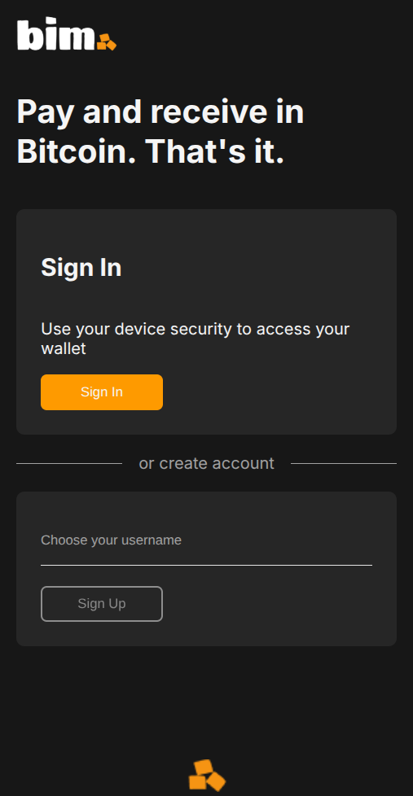
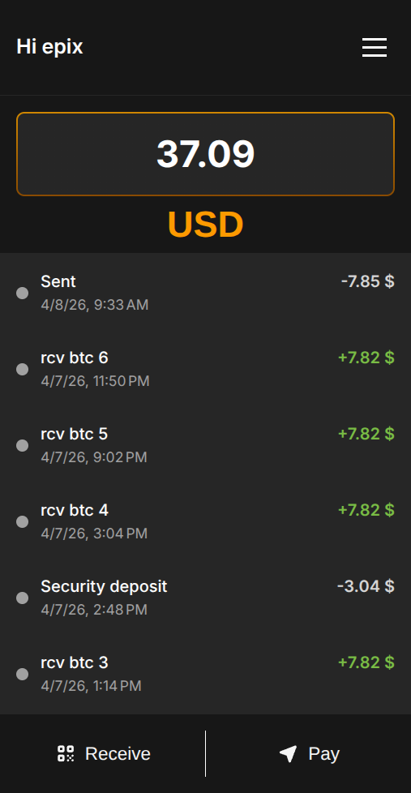
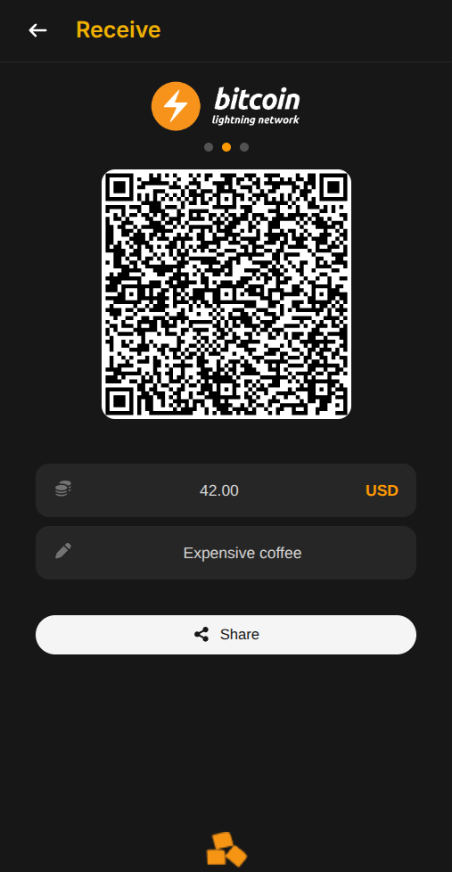

<div align="center">

# BIM — Bitcoin Is Money

**A Bitcoin wallet on Starknet, unlocked by your fingerprint.**

BIM lets anyone send and receive Bitcoin — on-chain, on the Lightning
Network, or as WBTC on Starknet — using nothing but a passkey. No seed
phrase to write down. No browser extension. No gas to pre-fund.

[](LICENSE)
[](.nvmrc)
[](https://www.typescriptlang.org/)
[](https://angular.dev/)
[](https://hono.dev/)
[](CODE_OF_CONDUCT.md)
[](CONTRIBUTING.md)

</div>

<br/>
<p align="center">
  
  &nbsp;&nbsp;&nbsp;&nbsp;&nbsp;&nbsp;&nbsp;&nbsp;
  
  &nbsp;&nbsp;&nbsp;&nbsp;&nbsp;&nbsp;&nbsp;&nbsp;
  
</p>
<br/>

## Why BIM?

Self-custodial Bitcoin wallets have historically forced users to choose
between two painful options:

- **Seed phrases** — secure, but a catastrophic UX problem. Lost phrases
  mean lost funds forever.
- **Custodial wallets** — easy to use, but you don't own your coins.

BIM takes a third path: a **smart-contract wallet on Starknet**, unlocked
by **WebAuthn / passkeys** (the same biometric auth your phone and
browser already speak). The cryptographic heavy lifting happens inside
the Starknet account contract; the user only has to touch a fingerprint
sensor.

And because smart-contract accounts normally need gas to be deployed,
BIM leans on the [AVNU paymaster](https://avnu.fi/) (SNIP-29) to
**auto-deploy accounts for free** — transparently, the first time the
user sends a payment.

## Features

- **Passkey authentication** — register and log in with WebAuthn
  (Touch ID, Face ID, Windows Hello, hardware keys).
- **Self-custodial** — private keys are bound to the device's secure
  enclave; BIM never sees them.
- **Receive Bitcoin** — on-chain (BTC), Lightning (BOLT11 invoices), or
  as WBTC on Starknet. Pick the rail, get a QR code.
- **Pay anything** — scan a Lightning invoice, a Bitcoin address, or a
  Starknet contract call. BIM parses it, quotes the swap, and signs the
  transaction after a biometric confirmation.
- **Gasless deployment** — first payment auto-deploys the Starknet
  account via the AVNU paymaster. No preloaded gas required.
- **Transaction history** — an Apibara indexer streams Starknet
  `Transfer` events and surfaces them in the wallet.
- **Lightning ↔ Bitcoin ↔ Starknet swaps** — powered by the
  [Atomiq SDK](https://atomiq.fi/).
- **Operational tooling** — `@bim/cli` for health checks, E2E flows, and
  AVNU credit monitoring with Slack alerts.

## Tech Stack

| Layer | Tech |
|-------|------|
| **Backend** | [Hono](https://hono.dev/) on Node.js 22, ESM, built with [esbuild](https://esbuild.github.io/) |
| **Domain** | Pure TypeScript — hexagonal (ports & adapters), no framework dependencies |
| **Frontend** | [Angular 21](https://angular.dev/) PWA with signals and standalone components |
| **Indexer** | [Apibara](https://www.apibara.com/) streaming Starknet DNA events |
| **Database** | PostgreSQL + [Drizzle ORM](https://orm.drizzle.team/) |
| **Blockchain** | [Starknet](https://www.starknet.io/), [Atomiq SDK](https://atomiq.fi/) for swaps, [AVNU paymaster](https://avnu.fi/) for gasless deployment |
| **Auth** | [SimpleWebAuthn](https://simplewebauthn.dev/) for WebAuthn server verification |
| **Testing** | [Vitest](https://vitest.dev/) + [Testcontainers](https://testcontainers.com/) |
| **Infra** | Docker, [Terraform](https://www.terraform.io/), Scaleway Serverless Containers |
| **CI/CD** | GitHub Actions (deploy on push to `main`) |

## Architecture at a Glance

```
apps/api  ────┬────  apps/front    (Angular PWA, served by the API)
              │
              ├────  @bim/domain   (pure TS: entities, use cases, ports)
              │
              ├────  @bim/db       (PostgreSQL + Drizzle)
              │
              ├────  @bim/atomiq   (swap SDK adapter)
              │
              ├────  @bim/starknet (RPC + contract utils)
              │
              └────  @bim/slack    (alerting)

apps/indexer ──── PostgreSQL   (streams Starknet events, shared DB)
apps/cli     ──── apps/api     (ops + E2E)
```

The backend (`apps/api`) is the only process that talks to external
services (Atomiq, AVNU, Starknet RPC). The frontend displays data and
performs WebAuthn ceremonies; all business logic lives server-side.

**→ For a deeper dive, read [ARCHITECTURE.md](ARCHITECTURE.md).**

## Getting Started

### Prerequisites

- **Node.js ≥ 22** — `nvm use` works (see [`.nvmrc`](.nvmrc))
- **npm** — the version is pinned in the root `package.json`
- **Docker & Docker Compose** — for local PostgreSQL and integration
  tests

### Quick start

```bash
# 1. Clone
git clone https://github.com/bitcoin-is-money/bim.git
cd bim

# 2. Install workspace dependencies
npm install

# 3. Start PostgreSQL (docker-compose) and push the schema
npm run db:up

# 4. Create the secret env files (they can start empty)
touch apps/api/.env.testnet.secret
touch apps/api/.env.mainnet.secret
touch apps/indexer/.env.testnet.secret
touch apps/indexer/.env.mainnet.secret

# 5. Start the backend (testnet, port 8080)
npm run dev

# 6. In another terminal, start the Angular dev server (port 4200)
npm run dev:front
```

Open <http://localhost:4200>, register a passkey, and you're in. See
[`apps/api/.env.local.example`](apps/api/.env.local.example) for the
optional secrets (AVNU API key, Slack tokens, etc.).

### Running against mainnet

```bash
NETWORK=mainnet npm run dev
```

You will need a real `AVNU_API_KEY` (with credits) in
`apps/api/.env.mainnet.secret` — see the memory notes in
[CLAUDE.md](CLAUDE.md) for details.

## Project Structure

```
bim/
├── packages/                       # Libraries (pure TypeScript)
│   ├── lib/                        # @bim/lib      — shared utilities
│   ├── domain/                     # @bim/domain   — domain + use cases
│   ├── db/                         # @bim/db       — Drizzle schema & client
│   ├── test-toolkit/               # @bim/test-toolkit — test helpers
│   ├── atomiq/                     # @bim/atomiq   — Atomiq SDK adapter
│   ├── atomiq-storage-postgres/    # @bim/atomiq-storage-postgres
│   ├── slack/                      # @bim/slack    — Slack notifications
│   └── starknet/                   # @bim/starknet — Starknet RPC utils
├── apps/                           # Runnable applications
│   ├── api/                        # @bim/api     — Hono backend
│   ├── front/                      # @bim/front   — Angular frontend
│   ├── indexer/                    # @bim/indexer — Apibara indexer
│   └── cli/                        # @bim/cli     — ops CLI
├── infra/                          # Terraform (Scaleway)
├── doc/flow/                       # Payment flow diagrams
├── ARCHITECTURE.md                 # Technical architecture
├── CONTRIBUTING.md                 # How to contribute
├── CODE_OF_CONDUCT.md
├── SECURITY.md
├── CHANGELOG.md
└── LICENSE                         # GPL v3
```

## Testing

```bash
npm test                         # All unit tests across workspaces
npm run test:integration          # API integration tests (requires Docker)
npm run test -w @bim/domain       # Just the domain package
npm run test:testnet -w @bim/api  # Testnet suite (requires AVNU_API_KEY)
```

> ⚠️ **After editing any `packages/*` library**, rebuild them before
> running the API tests — API tests import from each library's compiled
> `dist/`, not from source, so stale output will cause misleading
> failures:
>
> ```bash
> npm run build:libs
> ```

More details on the testing pyramid, fixtures, and Testcontainers setup
in [ARCHITECTURE.md § Testing Pyramid](ARCHITECTURE.md#testing-pyramid).

## Scripts Reference

<details>
<summary><strong>Expand the full list of npm scripts</strong></summary>

### Development

| Command | Description |
|---------|-------------|
| `npm run dev` | Start API with tsx watch (testnet, port 8080) |
| `npm run dev:front` | Start Angular dev server (port 4200) |

### Build

| Command | Description |
|---------|-------------|
| `npm run build` | Build everything (api + indexer + frontend) |
| `npm run build:libs` | Build shared libraries |
| `npm run build:api` | Build API bundle (libs + api + frontend) |
| `npm run build:front` | Build Angular frontend |
| `npm run build:indexer` | Build Apibara indexer |

### Test

| Command | Description |
|---------|-------------|
| `npm test` | Run all unit tests (all workspaces) |
| `npm run test:integration` | Run API integration tests (requires Docker) |
| `npm run test:testnet -w @bim/api` | Run testnet tests |
| `npm run test:e2e -w @bim/api` | Run E2E tests against a deployed target |

### Database

| Command | Description |
|---------|-------------|
| `npm run db:up` | Start PostgreSQL container + push schema |
| `npm run db:push` | Push Drizzle schema to database |
| `npm run db:generate` | Generate Drizzle migration files |
| `npm run db:migrate` | Run pending migrations |
| `npm run db:studio` | Open Drizzle Studio (visual DB browser) |

### Docker

| Command | Description |
|---------|-------------|
| `npm run docker:up` | Build images + start full stack |
| `npm run docker:down` | Stop all containers |
| `npm run docker:logs` | Follow container logs |
| `npm run docker:build` | Build Docker images |
| `npm run docker:push` | Push images to Scaleway registry |
| `npm run docker:redeploy` | Update and redeploy Scaleway containers |
| `npm run docker:ship` | Build + push + redeploy (full deploy pipeline) |

Use `NETWORK=mainnet` to target mainnet (default: `testnet`):

```bash
NETWORK=mainnet npm run docker:up
```

### Infrastructure (Terraform)

| Command | Description |
|---------|-------------|
| `npm run infra:init` | Initialize Terraform |
| `npm run infra:plan` | Preview infrastructure changes |
| `npm run infra:apply` | Apply infrastructure changes |

### Lint & Security

| Command | Description |
|---------|-------------|
| `npm run lint` | Lint the entire monorepo |
| `npm run lint:fix` | Auto-fix lint errors |
| `npm run security` | Run audit + lockfile-lint |
| `npm run security:audit` | `better-npm-audit` (moderate level) |
| `npm run security:lockfile` | Validate lockfile hosts/HTTPS |

### Utility

| Command | Description |
|---------|-------------|
| `npm run clean` | Clean build outputs in all workspaces |
| `npm run clean:all` | Remove all `node_modules` and build outputs |
| `npm run deps:check` | List outdated dependencies |
| `npm run deps:update` | Bump dependencies (interactive) |

</details>

## Configuration

Each network has a committed defaults file and a gitignored secrets
file:

```
apps/api/.env.testnet         # Testnet defaults (committed)
apps/api/.env.testnet.secret  # Testnet secrets (gitignored, must exist)
apps/api/.env.mainnet         # Mainnet defaults (committed)
apps/api/.env.mainnet.secret  # Mainnet secrets (gitignored, must exist)
```

The `.secret` files must exist (they can be empty). See
[`apps/api/.env.local.example`](apps/api/.env.local.example) for the
full list of variables and their purpose.

## Documentation

- [**ARCHITECTURE.md**](ARCHITECTURE.md) — monorepo layout, dependency
  graph, hexagonal domain, gateways, WebAuthn flow, payment flows,
  testing pyramid.
- [**CONTRIBUTING.md**](CONTRIBUTING.md) — dev setup, coding conventions,
  testing rules, commit style, pull request process.
- [**SECURITY.md**](SECURITY.md) — vulnerability disclosure.
- [**CODE_OF_CONDUCT.md**](CODE_OF_CONDUCT.md) — community guidelines.
- [**CHANGELOG.md**](CHANGELOG.md) — release notes.
- [`doc/flow/`](doc/flow/) — step-by-step payment flow diagrams.
- [`infra/README.md`](infra/README.md) — infrastructure / Terraform
  specifics.

## Contributing

Contributions of all kinds are welcome — bug reports, fixes, features,
docs, tests. Start with [CONTRIBUTING.md](CONTRIBUTING.md) to get the
project running locally and see the coding conventions.

For anything larger than a small fix, please open an issue first so we
can align on the approach.

## Security

Found a vulnerability? **Please do not file a public issue.** See
[SECURITY.md](SECURITY.md) for private disclosure instructions.

## License

BIM is licensed under the [**GNU General Public License v3.0 or
later**](LICENSE). That means you're free to use, modify, and
redistribute BIM, but derivative works must also be open-source under a
compatible license.

## Acknowledgments

BIM stands on the shoulders of some great open-source work:

- **[Atomiq](https://atomiq.fi/)** — the swap SDK that makes Lightning ↔
  Bitcoin ↔ Starknet possible.
- **[AVNU](https://avnu.fi/)** — the SNIP-29 paymaster that makes
  gasless Starknet deployment a reality.
- **[Apibara](https://www.apibara.com/)** — the Starknet DNA indexer
  powering BIM's transaction history.
- **[Starknet](https://www.starknet.io/)** and **[StarkWare](https://starkware.co/)**
  — the L2 that made smart-contract wallets with custom signers viable.
- **[SimpleWebAuthn](https://simplewebauthn.dev/)** — by far the nicest
  WebAuthn library in the JS ecosystem.
- **[Hono](https://hono.dev/)**, **[Angular](https://angular.dev/)**,
  **[Drizzle](https://orm.drizzle.team/)**, **[Vitest](https://vitest.dev/)**,
  **[Testcontainers](https://testcontainers.com/)** — the backbone of
  the stack.

Thanks also to everyone who files issues, sends patches, and helps other
users. Open source wouldn't work without you.
