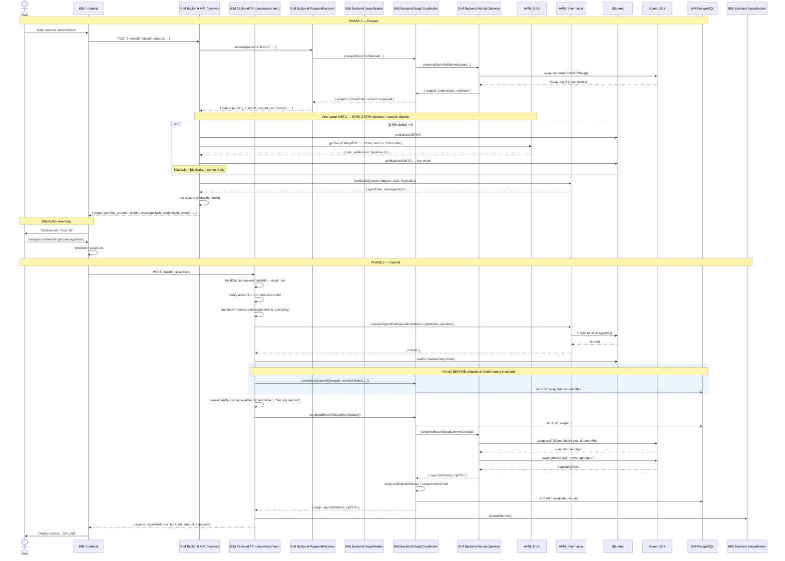

# Swap Commit — Bitcoin Two-Phase Receive Flow

> **Scope.** This doc describes the **two-phase receive flow for Bitcoin**.
> It is the most intricate flow in BIM and deserves its own document. For
> the high-level happy path see [receive-bitcoin.md](./receive-bitcoin.md);
> for the Lightning flow (no commit phase) see
> [receive-lightning.md](./receive-lightning.md).

## Why a two-phase flow?

Lightning receives are a single HTTP round trip: BIM asks Atomiq for an
invoice, returns it, done. Bitcoin receives cannot work this way, for two
cumulative reasons:

1. **The Atomiq escrow requires a security deposit.** Before Atomiq
   generates a Bitcoin deposit address, the user must first lock a
   **bounty in STRK** into the Atomiq escrow contract on Starknet. This
   bounty is what the LP (or the backend) will collect once the swap is
   claimed — it's the incentive that makes someone actually submit the
   claim transaction on the user's behalf. No bounty → no one claims →
   the user would have to claim the swap themselves.

2. **BIM keys are WebAuthn passkeys.** The Atomiq SDK returns unsigned
   Starknet transactions (`commitCalls`) for the escrow setup. These
   transactions can only be signed by the user's device (Touch ID, Face
   ID, security key). The backend cannot sign them; it must ship them to
   the frontend, have the user approve them via WebAuthn, and only then
   can it execute them.

The two-phase flow stitches these constraints together:

- **Phase 1** — `POST /api/payment/receive/` asks Atomiq for a quote,
  gets the `commitCalls`, automatically tops up STRK from WBTC if needed,
  builds a Starknet `EIP-712`-style typed message via the AVNU paymaster,
  and returns it to the frontend for WebAuthn signing.
- **Phase 2** — `POST /api/payment/receive/commit` receives the WebAuthn
  assertion, converts it into an Argent signature, executes the signed
  commit transaction via the AVNU paymaster (gasless), waits for
  confirmation, persists the swap in `committed` state, then asks Atomiq
  for the actual Bitcoin deposit address.

A Bitcoin receive is therefore:

```
[Phase 1] POST /api/payment/receive/          → commit data + buildId
          (frontend shows "Confirm with Touch ID")
          (user approves with WebAuthn)
[Phase 2] POST /api/payment/receive/commit   → deposit address + bip21Uri
          (frontend displays the QR code)
```

---

## Glossary

| Term | Meaning |
|------|---------|
| **Commit transaction** | The on-chain Starknet transaction that creates the Atomiq escrow for this swap. Multicall of `approve` (STRK to escrow) + protocol-specific init calls. |
| **Security deposit / bounty** | The STRK amount the user approves as part of the commit. Funds the claimer reward once the Bitcoin deposit is detected. Automatically refunded to the user by the backend after a successful claim (see [swap-monitor.md](./swap-monitor.md)). |
| **Build** | The typed data + metadata returned in phase 1. Cached server-side by `buildId` and consumed once in phase 2. |
| **`buildId`** | UUID identifying a phase-1 build. Single-use, short-lived. |
| **AVNU paymaster** | SNIP-29 paymaster that sponsors gas on Starknet. Used to make the commit transaction gasless for the user (no ETH/STRK gas fee). |
| **AVNU DEX** | AVNU's DEX aggregator. Used by BIM to atomically swap WBTC → STRK when the user's STRK balance is insufficient to cover the security deposit. |
| **`commitCalls`** | Unsigned Starknet calls extracted from the Atomiq SDK's `swap.txsCommit()`. Must be signed and submitted before the deposit address becomes available. |

---

## Phase 1 — `POST /api/payment/receive/` (network = bitcoin)

**Route:** `apps/api/src/routes/payment/receive/receive.routes.ts`.

`POST /api/payment/receive/` with `network: "bitcoin"` proceeds in five
steps:

1. **Quote.** `PaymentReceiver.prepareBitcoinReceive` asks
   `SwapCoordinator.prepareBitcoinToStarknet` for a quote. The
   coordinator validates the amount against the LP limits and calls
   `AtomiqGateway.prepareBitcoinToStarknetSwap`, which returns
   `{ swapId, commitCalls, expiresAt }` (the `commitCalls` are the
   unsigned Starknet multicall — typically `approve(STRK→escrow)` plus
   protocol-specific init calls).
2. **STRK top-up.** The route inspects the `approve` call to find the
   security deposit amount. If the user's STRK balance is below it,
   the route asks the AVNU DEX for `getSwapCalls(WBTC → STRK)`
   (rounded up to whole STRK with a +10 % slippage buffer, minimum
   50 STRK to avoid DEX "insufficient input" errors on tiny swaps)
   and prepends those calls to the multicall. If WBTC is also
   insufficient, an `InsufficientBalanceError` with
   `kind: 'security_deposit'` is thrown.
3. **Build.** `gateways.starknet.buildCalls` (AVNU paymaster) wraps
   the final calls into a SNIP-29 typed message and returns
   `{ typedData, messageHash }` so gas will be sponsored.
4. **Cache.** A `buildId` (UUID) is generated and the build is stored
   in the `ReceiveBuildCache` (in-memory, single-use, TTL'd).
5. **Respond.** `200 OK { status: "pending_commit", buildId,
   messageHash, credentialId, swapId, amount, expiresAt }`. No funds
   have moved yet — the user still has to sign with WebAuthn.

### What the frontend does between phase 1 and phase 2

1. Reads `messageHash` and `credentialId` from the response.
2. Calls `navigator.credentials.get(...)` with the `messageHash` as
   challenge and the `credentialId` as `allowCredentials`.
3. User approves with Touch ID / Face ID / security key.
4. Frontend receives a WebAuthn assertion
   (`authenticatorData`, `clientDataJSON`, `signature`).
5. Frontend sends these + the `buildId` to `POST /api/payment/receive/commit`.

No funds have moved yet. If the user cancels the WebAuthn prompt, the
build quietly expires and the Atomiq quote also expires — no harm done.

---

## Phase 2 — `POST /api/payment/receive/commit`

**Route:** `apps/api/src/routes/payment/receive/receive.routes.ts`.

`POST /api/payment/receive/commit` resumes the flow after WebAuthn:

1. **Consume the build.** `buildCache.consume(buildId)` is single-use
   (returns `400 BUILD_EXPIRED` if missing or already used). The
   account ownership is verified — `403 FORBIDDEN` if it doesn't
   match.
2. **Sign + execute.** The WebAuthn assertion is converted to an
   Argent-compatible signature; `gateways.starknet.executeSignedCalls`
   submits the multicall via the AVNU paymaster (gasless) and returns
   the `txHash`. The route waits for L2 confirmation with
   `waitForTransaction(txHash)`.
3. **Persist commit (load-bearing).** Immediately after confirmation,
   `SwapCoordinator.saveBitcoinCommit` writes the swap to the DB in
   `committed` state with the `commitTxHash`. **This must happen
   before completion** — see the next subsection.
4. **Label.** The commit tx is labelled `"Security deposit"` in the
   user's tx history (non-fatal if it fails).
5. **Complete.** `SwapCoordinator.completeBitcoinToStarknet` calls
   `AtomiqGateway.completeBitcoinSwapCommit`, which polls the SDK
   (`swap.waitTillCommited`, 90 s timeout) until the on-chain escrow
   is confirmed, then returns the Bitcoin deposit address. The swap
   transitions `committed → paid` and the deposit address is saved.
6. **Respond.** `swapMonitor?.ensureRunning()`, then
   `200 OK { swapId, depositAddress, bip21Uri, amount, expiresAt }`.

### Why the swap is persisted *before* completion

`saveBitcoinCommit()` is called **immediately after the commit tx is
confirmed on-chain**, before the SDK has returned the Bitcoin deposit
address. This is deliberate:

- The on-chain commit is **irreversible** — the user's STRK is now
  locked in the Atomiq escrow.
- If `completeBitcoinSwapCommit()` throws (timeout, SDK error, container
  crash), there must be a record of the swap in the DB, otherwise the
  `SwapMonitor` would have nothing to watch and the user's funds would
  be silently stranded.
- Persisting in the `committed` state with only the `commitTxHash` is
  enough for the monitor to pick the swap up on the next iteration,
  retry `getSwapStatus()`, and eventually recover the deposit address
  via the SDK's `_sync(true)` mechanism.

This is a load-bearing invariant. **Never move the `saveBitcoinCommit`
call below `swapCoordinator.completeBitcoinToStarknet`.**

---

## The `committed` state

The `Swap` state machine has a dedicated `committed` state for Bitcoin
receives — "the Starknet escrow is funded, but Atomiq has not yet
handed back the Bitcoin deposit address". Bitcoin receives skip
`pending` entirely and start in `committed`.

Progress values:

| Status | Progress |
|--------|----------|
| `committed` | 10 % |
| `paid` | 33 % |
| `claimable` | 50 % |
| `completed` | 100 % |

`getTxHash()` returns the `commitTxHash` in `committed`, the
`lastClaimTxHash` in `claimable`, and the final `txHash` once
`completed`.

---

## Why `bitcoin_to_starknet` in `expired` is **not** terminal

For Lightning, an expired swap is terminal — nothing more can happen.
For Bitcoin, an expired swap (typically: user never sent BTC in time)
still has a **security deposit locked in the escrow contract**. Atomiq
auto-refunds it after the on-chain timelock, transitioning the swap to
`refunded`.

`Swap.isTerminal()` returns `false` for the
`(expired, bitcoin_to_starknet)` combination, so the `SwapMonitor`
keeps polling and picks up the eventual refund. The user is never
asked to sign anything — the STRK simply reappears in their account
when the contract releases it.

This is the practical reason the `refundable` / `refunded` / `lost`
states exist and why you should **not** collapse them into `failed`
when simplifying the state machine.

---

## Sequence diagram



---

## Error scenarios

### Insufficient STRK and insufficient WBTC

If the user has neither enough STRK for the security deposit nor enough
WBTC to swap for STRK, phase 1 throws `InsufficientBalanceError` with
`kind: 'security_deposit'`. The frontend should explain:

> You need at least *X* STRK (or equivalent in WBTC) to cover the
> security deposit for a Bitcoin receive. This is a temporary lock and
> will be refunded once the swap completes.

### User cancels WebAuthn

No network call happens. The build stays cached until its TTL expires
(`ReceiveBuildCache` cleans up stale entries). The Atomiq quote also
expires on its own. No funds have moved.

### Build expired or missing

`buildCache.consume(buildId)` returns `undefined` → `400 BUILD_EXPIRED`.
The frontend should retry phase 1 to get a fresh build.

### Commit tx reverts

`gateways.starknet.executeSignedCalls()` throws. The swap is **not**
persisted to the DB (the `saveBitcoinCommit` call is below). The Atomiq
quote eventually expires; no funds moved. The frontend should retry
phase 1.

### Commit tx confirmed but `waitTillCommited` times out

Very rare, but possible (e.g., Atomiq SDK behind the on-chain state):
`saveBitcoinCommit` has already persisted the swap in `committed` state,
so the `SwapMonitor` will pick it up on the next iteration and recover
the deposit address via a subsequent `getSwapStatus()` call. The user
receives an error from phase 2 but the swap is **not** stuck — they can
refetch its status with `GET /api/swap/status/:swapId`.

### User never sends BTC

The Atomiq quote expires → Atomiq's on-chain state transitions the swap
through its internal timeouts → eventually the contract auto-refunds the
security deposit. The monitor picks up each transition and ends up
marking the swap as `refunded`. Total time: up to a few hours.

### User sends BTC but the Bitcoin tx takes too long to confirm

Bitcoin mempool congestion can delay 1-confirmation by hours. Atomiq's
deposit quote has its own TTL; if BTC arrives after it, the LP may or
may not honor the swap. The Atomiq SDK `_sync(true)` call in
`getSwapStatus()` forces a fresh on-chain read, which helps recover
edge cases where the SDK reported `expired` prematurely.
