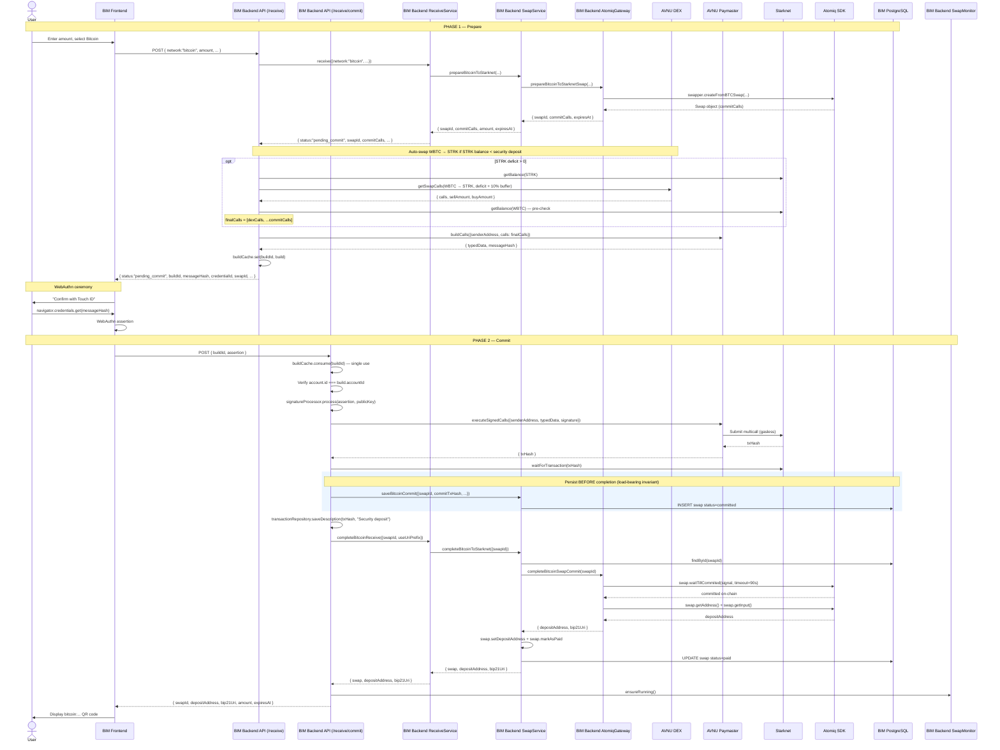

# Swap Commit — Bitcoin Two-Phase Receive Flow

> **Scope.** This doc describes the **two-phase receive flow for Bitcoin**.
> It is the most intricate flow in BIM and deserves its own document. For
> the high-level happy path see [receive-bitcoin.md](./receive-bitcoin.md);
> for the Lightning flow (no commit phase) see
> [receive-lightning.md](./receive-lightning.md).

## Why a two-phase flow?

Lightning receives are a single HTTP round trip: BIM asks Atomiq for an
invoice, returns it, done. Bitcoin receives cannot work this way, for two
cumulative reasons:

1. **The Atomiq escrow requires a security deposit.** Before Atomiq
   generates a Bitcoin deposit address, the user must first lock a
   **bounty in STRK** into the Atomiq escrow contract on Starknet. This
   bounty is what the LP (or the backend) will collect once the swap is
   claimed — it's the incentive that makes someone actually submit the
   claim transaction on the user's behalf. No bounty → no one claims →
   the user would have to claim the swap themselves.

2. **BIM keys are WebAuthn passkeys.** The Atomiq SDK returns unsigned
   Starknet transactions (`commitCalls`) for the escrow setup. These
   transactions can only be signed by the user's device (Touch ID, Face
   ID, security key). The backend cannot sign them; it must ship them to
   the frontend, have the user approve them via WebAuthn, and only then
   can it execute them.

The two-phase flow stitches these constraints together:

- **Phase 1** — `POST /api/payment/receive/` asks Atomiq for a quote,
  gets the `commitCalls`, automatically tops up STRK from WBTC if needed,
  builds a Starknet `EIP-712`-style typed message via the AVNU paymaster,
  and returns it to the frontend for WebAuthn signing.
- **Phase 2** — `POST /api/payment/receive/commit` receives the WebAuthn
  assertion, converts it into an Argent signature, executes the signed
  commit transaction via the AVNU paymaster (gasless), waits for
  confirmation, persists the swap in `committed` state, then asks Atomiq
  for the actual Bitcoin deposit address.

A Bitcoin receive is therefore:

```
[Phase 1] POST /api/payment/receive/          → commit data + buildId
          (frontend shows "Confirm with Touch ID")
          (user approves with WebAuthn)
[Phase 2] POST /api/payment/receive/commit   → deposit address + bip21Uri
          (frontend displays the QR code)
```

---

## Glossary

| Term | Meaning |
|------|---------|
| **Commit transaction** | The on-chain Starknet transaction that creates the Atomiq escrow for this swap. Multicall of `approve` (STRK to escrow) + protocol-specific init calls. |
| **Security deposit / bounty** | The STRK amount the user approves as part of the commit. Funds the claimer reward once the Bitcoin deposit is detected. Automatically refunded to the user by the backend after a successful claim (see [swap-monitor.md](./swap-monitor.md)). |
| **Build** | The typed data + metadata returned in phase 1. Cached server-side by `buildId` and consumed once in phase 2. |
| **`buildId`** | UUID identifying a phase-1 build. Single-use, short-lived. |
| **AVNU paymaster** | SNIP-29 paymaster that sponsors gas on Starknet. Used to make the commit transaction gasless for the user (no ETH/STRK gas fee). |
| **AVNU DEX** | AVNU's DEX aggregator. Used by BIM to atomically swap WBTC → STRK when the user's STRK balance is insufficient to cover the security deposit. |
| **`commitCalls`** | Unsigned Starknet calls extracted from the Atomiq SDK's `swap.txsCommit()`. Must be signed and submitted before the deposit address becomes available. |

---

## Phase 1 — `POST /api/payment/receive/` (network = bitcoin)

**Route:** `apps/api/src/routes/payment/receive/receive.routes.ts:43-178`

### Happy path

```
POST /api/payment/receive/                    (receive.routes.ts:43)
│
├── Auth middleware → account
├── ReceiveSchema.parse(body)                  (receive.types.ts:3-8)
│       { network: "bitcoin", amount: "500000", description?, useUriPrefix? }
│
├── account.getStarknetAddress() → starknetAddress
│       (400 ACCOUNT_NOT_DEPLOYED if missing)
│
├── amount = Amount.ofSatoshi(BigInt(input.amount))
│
├── receiveService.receive({network:"bitcoin", ...})
│   │
│   └── ReceiveService.prepareBitcoinReceive()
│       │   (receive.service.ts:122-141)
│       │
│       └── swapService.prepareBitcoinToStarknet({amount, destinationAddress, ...})
│           │   (swap.service.ts:212-240)
│           │
│           ├── validateAmountAgainstLimits()       ← SwapAmountError if out of range
│           │
│           ├── atomiqGateway.prepareBitcoinToStarknetSwap({amountSats, destinationAddress})
│           │   │   (atomiq.gateway.ts:353-412)
│           │   │
│           │   ├── swapper.createFromBTCSwap(
│           │   │     'STARKNET', destinationAddress, swapToken.address,
│           │   │     amountSats, exactOut=true,
│           │   │     undefined,
│           │   │     {unsafeZeroWatchtowerFee: true}
│           │   │   )
│           │   ├── swapId = swap.getId()
│           │   ├── commitCalls = extractCommitCalls(swap)   ← via swap.txsCommit()
│           │   ├── expiresAt = new Date(swap.getQuoteExpiry())
│           │   └── return { swapId, commitCalls, expiresAt }
│           │
│           └── return { swapId, commitCalls, amount, expiresAt }
│
│   → returns {
│         network: "bitcoin",
│         status: "pending_commit",
│         swapId, commitCalls, amount, expiresAt
│       }
│
├── (Route code continues on receive.routes.ts:67-170)
│
├── Auto-swap WBTC → STRK if needed                (receive.routes.ts:73-129)
│   │
│   ├── extractApproveAmount(commitCalls)          (receive.routes.ts:270-287)
│   │     Finds the 'approve' call in commitCalls and decodes its u256 amount
│   │     (calldata = [spender, low, high]; amount = low + high << 128)
│   │
│   ├── If the approved token is STRK (security deposit token):
│   │   │
│   │   ├── Fetch user's STRK balance on Starknet
│   │   │
│   │   ├── rawDeficit = approveAmount - strkBalance
│   │   │
│   │   ├── If rawDeficit > 0:
│   │   │   │
│   │   │   ├── deficit = max(
│   │   │   │     roundUpToWholeStrk(rawDeficit * 1.10),   ← +10% slippage buffer
│   │   │   │     50 STRK                                    ← MIN_SWAP to avoid
│   │   │   │                                                  DEX "insufficient
│   │   │   │                                                  input amount" on
│   │   │   │                                                  tiny swaps
│   │   │   │   )
│   │   │   │
│   │   │   ├── gateways.dex.getSwapCalls({
│   │   │   │       sellToken: WBTC, buyToken: STRK,
│   │   │   │       buyAmount: deficit, takerAddress
│   │   │   │   })
│   │   │   │   → { calls: [approveWbtc, swapWbtcForStrk], sellAmount, buyAmount }
│   │   │   │
│   │   │   ├── Pre-check: user has >= sellAmount WBTC
│   │   │   │     (else throws InsufficientBalanceError 'security_deposit')
│   │   │   │
│   │   │   └── finalCalls = [...dexCalls, ...commitCalls]
│   │   │
│   │   └── Else (enough STRK): finalCalls = commitCalls
│   │
│   └── Else (approve is not for STRK, or no approve): finalCalls = commitCalls
│
├── buildCalls via AVNU paymaster                  (receive.routes.ts:131-143)
│   │
│   ├── gateways.starknet.buildCalls({senderAddress, calls: finalCalls})
│   │     → { typedData, messageHash }
│   │     Uses the AVNU paymaster to produce a SNIP-29 typed message
│   │     that will sponsor gas on Starknet (user pays 0 ETH/STRK for gas).
│   │
│   └── If buildCalls throws InsufficientBalanceError, re-throw it with
│       kind='security_deposit' and the approve amount, so the frontend can
│       surface "You don't have enough STRK for the security deposit" to the user.
│
├── Cache the build                                (receive.routes.ts:148-159)
│   │
│   ├── buildId = randomUUID()
│   └── buildCache.set(buildId, {
│         swapId, typedData, senderAddress, accountId, amount,
│         expiresAt, description, useUriPrefix, createdAt: now
│       })
│
│   The ReceiveBuildCache is an in-memory, single-use, TTL'd map:
│   apps/api/src/routes/payment/receive/receive-build.cache.ts
│
└── 200 OK {
      network: "bitcoin",
      status: "pending_commit",
      buildId,                ← frontend passes this back in phase 2
      messageHash,            ← message to sign with WebAuthn
      credentialId,           ← which passkey to use
      swapId,
      amount, expiresAt
    }
```

### What the frontend does between phase 1 and phase 2

1. Reads `messageHash` and `credentialId` from the response.
2. Calls `navigator.credentials.get(...)` with the `messageHash` as
   challenge and the `credentialId` as `allowCredentials`.
3. User approves with Touch ID / Face ID / security key.
4. Frontend receives a WebAuthn assertion
   (`authenticatorData`, `clientDataJSON`, `signature`).
5. Frontend sends these + the `buildId` to `POST /api/payment/receive/commit`.

No funds have moved yet. If the user cancels the WebAuthn prompt, the
build quietly expires and the Atomiq quote also expires — no harm done.

---

## Phase 2 — `POST /api/payment/receive/commit`

**Route:** `apps/api/src/routes/payment/receive/receive.routes.ts:184-256`

### Happy path

```
POST /api/payment/receive/commit               (receive.routes.ts:184)
│
├── Auth middleware → account
├── ReceiveCommitSchema.parse(body)              (receive.types.ts:16-19)
│       { buildId: uuid, assertion: {authenticatorData, clientDataJSON, signature} }
│
├── build = buildCache.consume(buildId)          ← single-use
│       → 400 BUILD_EXPIRED if the build is missing or already consumed
│
├── Account ownership check
│       if account.id !== build.accountId
│         → 403 FORBIDDEN 'Build does not belong to this account'
│
├── signature = WebAuthnSignatureProcessor.process(input.assertion, account.publicKey)
│       │   (apps/api/src/adapters/webauthn-signature-processor.ts)
│       │
│       ├── Verifies the assertion against the cached challenge (messageHash)
│       └── Converts it into an Argent-compatible Starknet signature
│
├── gateways.starknet.executeSignedCalls({
│     senderAddress: build.senderAddress,
│     typedData: build.typedData,
│     signature
│   })
│   │
│   ├── Sends the signed typed data to the AVNU paymaster
│   ├── AVNU executes the multicall on Starknet (gas sponsored)
│   └── returns { txHash }
│
├── gateways.starknet.waitForTransaction(txHash)
│       Blocks until the Starknet node confirms the tx (ACCEPTED_ON_L2).
│
├── swapService.saveBitcoinCommit({             ← IMPORTANT: persist BEFORE completing
│     swapId, destinationAddress: starknetAddress,
│     amount, description, accountId,
│     commitTxHash: txHash, expiresAt
│   })
│   │   (swap.service.ts:249-267)
│   │
│   ├── Swap.createBitcoinToStarknetCommitted(...)
│   │     → new Swap entity in state {
│   │         status: 'committed',
│   │         commitTxHash, committedAt: now
│   │       }
│   │     No deposit address yet — the swap is known on-chain but the
│   │     Bitcoin address has not been handed back by the SDK.
│   │
│   └── swapRepository.save(swap)
│
│   Why save here (before the deposit address is known)?
│   If the next step (completeBitcoinSwapCommit) fails or the container
│   crashes, the SwapMonitor will still find the swap in the DB and
│   continue polling Atomiq. Otherwise the user's security deposit
│   would be locked on-chain with no way for BIM to track the swap.
│
├── transactionRepository.saveDescription(
│     txHash, accountId, 'Security deposit'
│   )                                             ← non-fatal if it fails
│       Labels the commit tx as "Security deposit" in the user's tx history.
│
├── receiveService.completeBitcoinReceive({swapId, useUriPrefix})
│   │   (receive.service.ts:147-167)
│   │
│   └── swapService.completeBitcoinToStarknet({swapId})
│       │   (swap.service.ts:277-309)
│       │
│       ├── swapRepository.findById(swapId)
│       │     → throws SwapNotFoundError if missing
│       │
│       ├── atomiqGateway.completeBitcoinSwapCommit(swapId)
│       │   │   (atomiq.gateway.ts:414-446)
│       │   │
│       │   ├── swap = swapper.getSwapById(swapId, 'STARKNET')
│       │   ├── abortController with 90s timeout
│       │   ├── swap.waitTillCommited(abortSignal)
│       │   │     Polls Atomiq's on-chain state until the escrow is confirmed
│       │   │     (transitions to CLAIM_COMMITED). Normally fast because we
│       │   │     already waited for the tx above, but the SDK has its own
│       │   │     view and may need a few seconds to pick up the event.
│       │   ├── depositAddress = swap.getAddress()
│       │   ├── amount = swap.getInput()?.rawAmount
│       │   └── return {
│       │         depositAddress,
│       │         bip21Uri: `bitcoin:${depositAddress}?amount=${BTC}`
│       │       }
│       │
│       ├── swap.setDepositAddress(depositAddress)
│       ├── swap.markAsPaid()                   ← transition committed → paid
│       ├── swapRepository.save(swap)
│       │
│       └── return { swap, depositAddress, bip21Uri }
│
├── swapMonitor.ensureRunning()
│       No-op if the monitor is already running from a previous swap;
│       otherwise starts the 5s polling loop.
│
└── 200 OK {
      network: "bitcoin",
      swapId,
      depositAddress,
      bip21Uri,                  ← "bitcoin:bc1q.../?amount=0.005"
      amount: { value, currency: "SAT" },
      expiresAt
    }
```

### Why the swap is persisted *before* completion

`saveBitcoinCommit()` is called **immediately after the commit tx is
confirmed on-chain**, before the SDK has returned the Bitcoin deposit
address. This is deliberate:

- The on-chain commit is **irreversible** — the user's STRK is now
  locked in the Atomiq escrow.
- If `completeBitcoinSwapCommit()` throws (timeout, SDK error, container
  crash), there must be a record of the swap in the DB, otherwise the
  `SwapMonitor` would have nothing to watch and the user's funds would
  be silently stranded.
- Persisting in the `committed` state with only the `commitTxHash` is
  enough for the monitor to pick the swap up on the next iteration,
  retry `getSwapStatus()`, and eventually recover the deposit address
  via the SDK's `_sync(true)` mechanism.

This is a load-bearing invariant. **Never move the `saveBitcoinCommit`
call below `completeBitcoinReceive`.**

---

## The `committed` state

The `Swap` entity's state machine includes a dedicated `committed` state
for Bitcoin receives. It encodes "the Starknet escrow is funded, but
Atomiq has not yet handed back the Bitcoin deposit address".

```ts
// packages/domain/src/swap/types.ts:58-68
export type SwapState =
  | { status: 'pending' }
  | { status: 'committed'; commitTxHash: string; committedAt: Date }
  | { status: 'paid'; paidAt: Date }
  | { status: 'claimable'; claimableAt: Date }
  | { status: 'completed'; txHash: string; completedAt: Date }
  | { status: 'expired'; expiredAt: Date }
  | { status: 'refundable'; refundableAt: Date }
  | { status: 'refunded'; refundedAt: Date }
  | { status: 'failed'; error: string; failedAt: Date }
  | { status: 'lost'; lostAt: Date };
```

Progress values (`swap.ts:279-298`):

| Status | Progress |
|--------|----------|
| `pending` | 0% (never used for Bitcoin — swap goes straight to `committed`) |
| `committed` | 10% |
| `paid` | 33% |
| `claimable` | 50% |
| `completed` | 100% |

`getTxHash()` returns the `commitTxHash` while the swap is in the
`committed` state, the `lastClaimTxHash` in `claimable`, and the final
`txHash` once `completed` (`swap.ts:150-161`).

---

## Why `bitcoin_to_starknet` in `expired` is **not** terminal

```ts
// packages/domain/src/swap/swap.ts:177-184
isTerminal(): boolean {
  // Expired bitcoin_to_starknet swaps are NOT terminal: the Atomiq smart
  // contract will auto-refund the security deposit after timelock expiry
  // (state -3).
  if (this.state.status === 'expired' && this.data.direction === 'bitcoin_to_starknet') {
    return false;
  }
  return ['completed', 'expired', 'failed', 'refunded', 'lost'].includes(this.state.status);
}
```

For Lightning, an expired swap is terminal — nothing more can happen.
For Bitcoin, an expired swap (typically: user never sent BTC in time)
has a **security deposit still locked in the escrow contract**. Atomiq
will auto-refund it after the timelock expires, which transitions the
swap to state `-3` (refunded) on-chain.

Because `isTerminal()` returns `false` for this specific combination,
the `SwapMonitor` keeps polling the swap, picks up the on-chain refund,
and transitions it to `refunded`. The user is never asked to sign
anything; the STRK simply reappears in their account when the smart
contract releases it.

This is the practical reason the `refundable` / `refunded` / `lost`
states exist and why you should **not** collapse them into `failed`
when simplifying the state machine.

---

## Sequence diagram



---

## Error scenarios

### Insufficient STRK and insufficient WBTC

If the user has neither enough STRK for the security deposit nor enough
WBTC to swap for STRK, phase 1 throws `InsufficientBalanceError` with
`kind: 'security_deposit'`. The frontend should explain:

> You need at least *X* STRK (or equivalent in WBTC) to cover the
> security deposit for a Bitcoin receive. This is a temporary lock and
> will be refunded once the swap completes.

### User cancels WebAuthn

No network call happens. The build stays cached until its TTL expires
(`ReceiveBuildCache` cleans up stale entries). The Atomiq quote also
expires on its own. No funds have moved.

### Build expired or missing

`buildCache.consume(buildId)` returns `undefined` → `400 BUILD_EXPIRED`.
The frontend should retry phase 1 to get a fresh build.

### Commit tx reverts

`gateways.starknet.executeSignedCalls()` throws. The swap is **not**
persisted to the DB (the `saveBitcoinCommit` call is below). The Atomiq
quote eventually expires; no funds moved. The frontend should retry
phase 1.

### Commit tx confirmed but `waitTillCommited` times out

Very rare, but possible (e.g., Atomiq SDK behind the on-chain state):
`saveBitcoinCommit` has already persisted the swap in `committed` state,
so the `SwapMonitor` will pick it up on the next iteration and recover
the deposit address via a subsequent `getSwapStatus()` call. The user
receives an error from phase 2 but the swap is **not** stuck — they can
refetch its status with `GET /api/swap/status/:swapId`.

### User never sends BTC

The Atomiq quote expires → Atomiq's on-chain state transitions the swap
through its internal timeouts → eventually the contract auto-refunds the
security deposit. The monitor picks up each transition and ends up
marking the swap as `refunded`. Total time: up to a few hours.

### User sends BTC but the Bitcoin tx takes too long to confirm

Bitcoin mempool congestion can delay 1-confirmation by hours. Atomiq's
deposit quote has its own TTL; if BTC arrives after it, the LP may or
may not honor the swap. The Atomiq SDK `_sync(true)` call in
`getSwapStatus()` forces a fresh on-chain read, which helps recover
edge cases where the SDK reported `expired` prematurely.

---

## Key file references

**Routes:**
- Phase 1: `apps/api/src/routes/payment/receive/receive.routes.ts:43-178`
- Phase 2: `apps/api/src/routes/payment/receive/receive.routes.ts:184-256`
- Zod schemas: `apps/api/src/routes/payment/receive/receive.types.ts:3-19`
- Response types: `apps/api/src/routes/payment/receive/receive.types.ts:57-66`
- Auto-swap WBTC → STRK: `apps/api/src/routes/payment/receive/receive.routes.ts:73-129`
- Build cache: `apps/api/src/routes/payment/receive/receive-build.cache.ts`

**Domain:**
- `ReceiveService.prepareBitcoinReceive`: `packages/domain/src/payment/receive.service.ts:122-141`
- `ReceiveService.completeBitcoinReceive`: `packages/domain/src/payment/receive.service.ts:147-167`
- `SwapService.prepareBitcoinToStarknet`: `packages/domain/src/swap/swap.service.ts:212-240`
- `SwapService.saveBitcoinCommit`: `packages/domain/src/swap/swap.service.ts:249-267`
- `SwapService.completeBitcoinToStarknet`: `packages/domain/src/swap/swap.service.ts:277-309`
- `Swap.createBitcoinToStarknetCommitted`: `packages/domain/src/swap/swap.ts:75-94`
- `Swap.setDepositAddress`: `packages/domain/src/swap/swap.ts:195-203`
- `Swap.isTerminal` (bitcoin expired exception): `packages/domain/src/swap/swap.ts:177-184`

**Adapter:**
- `AtomiqSdkGateway.prepareBitcoinToStarknetSwap`: `packages/atomiq/src/atomiq.gateway.ts:353-412`
- `AtomiqSdkGateway.completeBitcoinSwapCommit`: `packages/atomiq/src/atomiq.gateway.ts:414-446`
- `extractCommitCalls` helper: `packages/atomiq/src/atomiq.gateway.ts:508-533`

**Ports:**
- `AtomiqGateway` interface: `packages/domain/src/ports/gateways.ts:176-250`
- `BitcoinSwapQuote`, `BitcoinSwapCommitResult`: `packages/domain/src/ports/gateways.ts:293-304`
