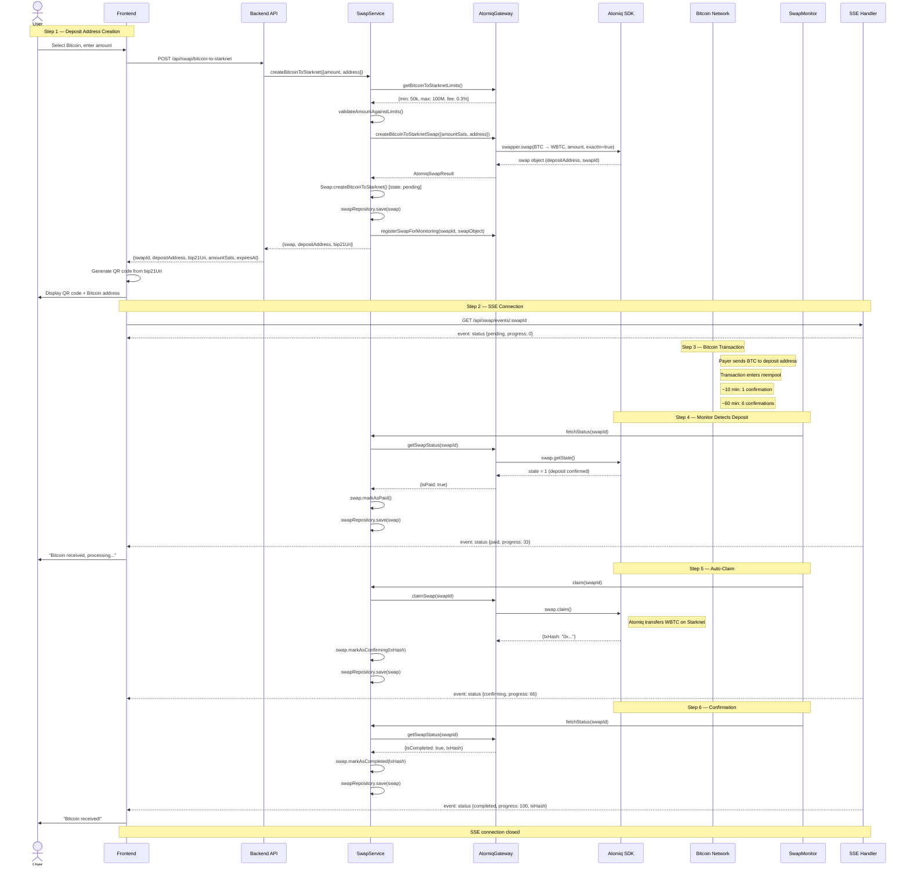

# Receive Bitcoin — Bitcoin to Starknet Flow

## Overview

The user wants to **receive on-chain Bitcoin**. The backend creates a cross-chain swap (Bitcoin → Starknet) via the Atomiq SDK. The user receives a Bitcoin deposit address (and BIP-21 URI) displayed as a QR code. When Bitcoin is sent to this address and confirmed on-chain, the swap is auto-claimed and WBTC is transferred to the user's Starknet address.

This flow is structurally similar to [Lightning receive](./receive-lightning.md) but with important differences:
- **Longer wait times** (Bitcoin block confirmation: 10-60 min vs Lightning: instant)
- **Deposit tracking edge case** (user sends BTC but swap may show "expired")
- **Higher fees** (on-chain costs)

### Actors

Same as [Lightning receive](./receive-lightning.md) — User, Frontend, Backend API, SwapService, AtomiqGateway, Atomiq SDK, SwapMonitor, SSE Handler, plus:

| Actor | Role |
|-------|------|
| **Payer** | External person/wallet sending Bitcoin on-chain |
| **Bitcoin Network** | On-chain transaction confirmation (1-6 blocks) |

---

## Sequence Diagram



---

## Detailed Tree: Deposit Address Creation

```
User clicks "Create Invoice" on Bitcoin receive page
│
├── Frontend
│   ├── Read amount from input (in user's display currency)
│   ├── Convert to satoshis via CurrencyService
│   ├── Read starknetAddress from AuthService (current user)
│   └── POST /api/swap/bitcoin-to-starknet
│       Body: { amountSats: "500000", destinationAddress: "0x..." }
│
├── Backend Route (swap.routes.ts)
│   ├── Validate body with Zod (CreateBitcoinSwapSchema)
│   │   ├── amountSats: string → BigInt
│   │   └── destinationAddress: string
│   ├── Convert to Amount: Amount.ofSatoshi(amountSats)
│   └── Call swapService.createBitcoinToStarknet({amount, destinationAddress})
│
├── SwapService.createBitcoinToStarknet()
│   ├── Validate destination: StarknetAddress.of(input.destinationAddress)
│   │
│   ├── Fetch limits: atomiqGateway.getBitcoinToStarknetLimits()
│   │   └── Returns { minSats: 50000n, maxSats: 100000000n, feePercent: 0.3 }
│   │
│   ├── Validate amount against limits
│   │   └── Throws SwapAmountError if out of range
│   │
│   ├── Create swap via Atomiq
│   │   atomiqGateway.createBitcoinToStarknetSwap({amountSats, destinationAddress})
│   │   │
│   │   └── AtomiqSdkGateway
│   │       ├── Ensure SDK initialized
│   │       ├── swapper.swap(Tokens.BITCOIN.BTC, Tokens.STARKNET.WBTC,
│   │       │               amountSats, exactIn=true, undefined, destinationAddress)
│   │       ├── Extract deposit address: swap.getAddress() → "bc1q4ntf..."
│   │       ├── Build BIP-21 URI: "bitcoin:bc1q4ntf...?amount=0.005"
│   │       ├── Register in internal swapRegistry
│   │       └── Return { swapId, depositAddress, bip21Uri, expiresAt: now+3h, swapObject }
│   │
│   ├── Validate deposit address exists
│   │   └── Throws SwapCreationError if no address returned
│   │
│   ├── Create domain entity: Swap.createBitcoinToStarknet({...})
│   │   └── State: pending, direction: bitcoin_to_starknet
│   │
│   ├── Save to repository: swapRepository.save(swap)
│   │
│   ├── Register for monitoring: atomiqGateway.registerSwapForMonitoring(swapId, swapObject)
│   │
│   └── Return { swap, depositAddress, bip21Uri }
│
└── Backend Route
    └── Return HTTP 200:
        {
          swapId: "xyz789",
          depositAddress: "bc1q4ntf...",
          bip21Uri: "bitcoin:bc1q4ntf...?amount=0.005",
          amountSats: "500000",
          expiresAt: "2025-01-15T15:00:00Z"
        }
```

---

## Key Difference: Bitcoin Deposit Tracking Edge Case

### The Problem

Bitcoin transactions are **irreversible** once broadcast. If the user sends BTC to the deposit address but the Atomiq swap expires before the Bitcoin transaction is confirmed, the swap state becomes "expired" even though the user's funds are in transit.

Timeline of the problem:

```
T+0:00  User creates swap (expires in 3 hours)
T+0:05  User sends BTC to deposit address
T+0:10  Bitcoin TX enters mempool (unconfirmed)
T+2:55  Atomiq marks swap as "expired" (approaching expiry)
T+3:00  Bitcoin TX confirmed (1 block)
        → Swap is "expired" but BTC deposit is confirmed
        → User sees "expired" but their BTC is locked
```

### The Fix

The SwapMonitor must handle this case in `syncWithAtomiq()`:

```
syncWithAtomiq(swap) for Bitcoin→Starknet swaps:
│
├── atomiqGateway.getSwapStatus(swapId) returns { isExpired: true }
│
├── BUT: also check if Atomiq SDK reports a paid/confirmed state
│   (Atomiq SDK may report expired at protocol level
│    while the deposit is actually confirmed at chain level)
│
├── If SDK state >= 1 (deposit confirmed) despite expired flag:
│   ├── Do NOT mark as expired
│   ├── Instead: swap.markAsPaid()
│   └── Proceed with claim (the Atomiq SDK supports late claims)
│
└── If SDK state == 0 AND expired:
    └── swap.markAsExpired() (genuinely expired, no deposit)
```

### Implementation Detail

The old project handled this with a `depositTrackingSwaps` Map in the SwapMonitorService. The new project needs equivalent logic in `syncWithAtomiq()` or as a dedicated check in the `SwapMonitor`.

```
Proposed logic in SwapService.syncWithAtomiq():
│
├── Get Atomiq status: { state, isPaid, isExpired, ... }
│
├── If isExpired AND direction is bitcoin_to_starknet:
│   │
│   ├── If isPaid (state >= 1):
│   │   └── Override: treat as paid, NOT expired
│   │       (user already sent BTC, it's confirmed)
│   │
│   └── If NOT isPaid (state == 0):
│       └── Genuinely expired: mark as expired
│
└── For other directions: handle normally
```

---

## State Machine

Same as [Lightning receive](./receive-lightning.md) but with longer durations:

```
                    ┌──────────────────────────────────────┐
                    │            PENDING (0%)               │
                    │  Deposit address created,             │
                    │  waiting for Bitcoin transaction       │
                    └─────────────┬────────────────────────┘
                                  │
                    ┌─────────────┼──────────────┐
                    │             │              │
                    ▼             │              ▼
            ┌──────────┐         │      ┌──────────────┐
            │ EXPIRED  │         │      │   FAILED     │
            │ No BTC   │         │      │ SDK error    │
            │ received │         │      └──────────────┘
            └──────────┘         │
               ⚠ See edge case   │
                                 ▼
                    ┌──────────────────────────────────────┐
                    │              PAID (33%)               │
                    │  Bitcoin deposit confirmed on-chain    │
                    │  → SwapMonitor auto-triggers claim    │
                    └─────────────┬────────────────────────┘
                                  │
                                  ▼
                    ┌──────────────────────────────────────┐
                    │          CONFIRMING (66%)             │
                    │  Claim TX submitted on Starknet       │
                    └─────────────┬────────────────────────┘
                                  │
                                  ▼
                    ┌──────────────────────────────────────┐
                    │          COMPLETED (100%)             │
                    │  WBTC transferred to user's address   │
                    └──────────────────────────────────────┘
```

---

## Timing

| Phase | Expected Duration | Timeout |
|-------|-------------------|---------|
| Deposit address creation | < 2s | — |
| Waiting for Bitcoin TX broadcast | User-dependent | — |
| Bitcoin TX confirmation (1 block) | ~10 min | 3 hours (swap expiry) |
| Payment detection (monitor poll) | 0-5s after confirmation | — |
| Claim execution | 2-10s | 60s |
| Starknet confirmation | 5-30s | 5 min |
| **Total (optimistic)** | **~10-15 min after BTC send** | — |

---

## Differences from Lightning Receive

| Aspect | Lightning | Bitcoin |
|--------|-----------|---------|
| **QR content** | BOLT-11 invoice (`lnbc...`) | BIP-21 URI (`bitcoin:bc1q...?amount=0.005`) |
| **Payment speed** | Instant (< 1s) | 10-60 min (block confirmation) |
| **Swap expiry** | 30 min | 3 hours |
| **Min amount** | 10,000 sats | 50,000 sats |
| **Max amount** | 10,000,000 sats (0.1 BTC) | 100,000,000 sats (1 BTC) |
| **Fee** | 0.5% | 0.3% |
| **Deposit edge case** | None (Lightning is atomic) | Deposit confirmed but swap expired |
| **Payment reversibility** | Irreversible once paid | Irreversible once broadcast |

---

## Error Scenarios

### Swap expires before Bitcoin deposit

```
Monitor detects: Atomiq state < 0 AND no deposit confirmed
├── syncWithAtomiq() calls swap.markAsExpired()
├── SSE pushes: { status: "expired" }
└── Frontend shows: "Swap expired. No Bitcoin was received."
    └── User can create a new swap
```

### Swap "expires" but Bitcoin deposit IS confirmed (edge case)

```
Monitor detects: Atomiq isExpired=true BUT isPaid=true (state >= 1)
├── syncWithAtomiq() overrides: treat as paid, NOT expired
├── swap.markAsPaid()
├── SSE pushes: { status: "paid" }
├── SwapMonitor auto-claims
└── Swap completes normally
```

### Bitcoin TX stuck in mempool (low fee)

```
User sends BTC with too-low fee
├── TX stays in mempool for hours
├── Atomiq swap expires (3h)
├── If TX eventually confirms:
│   └── Atomiq SDK may still detect it and allow late claim
│       (depends on Atomiq's grace period — verify with SDK docs)
│
└── If TX never confirms (replaced or dropped):
    └── BTC returns to sender (no loss)
```

### User sends wrong amount

```
User sends less or more BTC than specified
├── Atomiq SDK handles amount mismatch:
│   ├── Less: may reject or adjust swap (SDK-dependent)
│   └── More: excess may be refunded or absorbed (SDK-dependent)
└── This behavior depends on Atomiq SDK configuration
    └── Verify exact behavior during integration testing
```

---

## Implementation TODO

### Backend — Already Exists

- [x] `SwapService.createBitcoinToStarknet()` — creates swap, returns deposit address
- [x] `SwapService.fetchStatus()` — syncs with Atomiq, returns state
- [x] `SwapService.claim()` — claims a paid swap
- [x] `AtomiqSdkGateway.createBitcoinToStarknetSwap()` — Atomiq SDK integration
- [x] `POST /api/swap/bitcoin-to-starknet` route
- [x] `GET /api/swap/status/:swapId` route

### Backend — To Implement

- [ ] Bitcoin deposit tracking edge case in `syncWithAtomiq()` (see above)
- [ ] `SwapMonitor` (shared — see [swap-monitor.md](./swap-monitor.md))
- [ ] SSE endpoint (shared — see [swap-monitor.md](./swap-monitor.md))
- [ ] Add fee information to swap creation response

### Frontend — To Implement

- [ ] "Create Invoice" button handler: call `POST /api/swap/bitcoin-to-starknet`
- [ ] Display BIP-21 URI as QR code
- [ ] Also display raw Bitcoin address (for manual copy)
- [ ] Connect to SSE for status updates
- [ ] Handle long wait times (show "waiting for Bitcoin confirmation..." with appropriate UX)
- [ ] Handle expired + deposit edge case (reassure user their BTC is safe)
