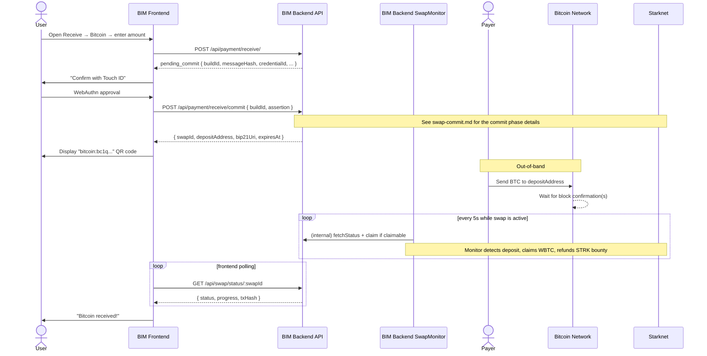

# Receive Bitcoin — Bitcoin → Starknet Flow

> **Scope.** User-level overview of the on-chain Bitcoin receive flow.
> **The mechanics of the two-phase commit are in their own document:**
> **[swap-commit.md](./receive-bitcoin-swap-commit.md).** Read that one first if you
> care about implementation details — this file mostly discusses the
> user experience, state machine, and how Bitcoin differs from Lightning.
>
> Related: [receive-lightning.md](./receive-lightning.md),
> [swap-monitor.md](./swap-monitor.md).

## Overview

A Bitcoin receive is a **Bitcoin → Starknet cross-chain swap** via the
Atomiq SDK. The user ends up with WBTC on Starknet after the Bitcoin
transaction confirms on-chain. Unlike Lightning, there is **no instant
finality** and the flow is more involved because:

1. The user must put up a **STRK security deposit** (bounty) before
   the swap can proceed — this is what pays the claimer once the BTC
   arrives.
2. The security deposit is locked via a **signed Starknet commit
   transaction**. Since BIM keys are WebAuthn passkeys, this commit
   requires a Touch ID / Face ID / security key confirmation from the
   user *before* the Bitcoin deposit address is even generated.

This is why the HTTP API has **two endpoints** for Bitcoin receives
where Lightning only has one. Everything about how that commit is
built, signed, executed, and persisted lives in
[swap-commit.md](./receive-bitcoin-swap-commit.md) — we don't repeat it here.

---

## What the user sees

1. User opens the "Receive" page, picks "Bitcoin", enters an amount.
2. Frontend calls `POST /api/payment/receive/` with
   `{ network: "bitcoin", amount }`.
3. Backend responds with `status: "pending_commit"` plus the data
   needed to trigger a WebAuthn ceremony (`buildId`, `messageHash`,
   `credentialId`).
4. Frontend shows **"Confirm with Touch ID"**. The user approves.
5. Frontend calls `POST /api/payment/receive/commit` with the WebAuthn
   assertion.
6. Backend executes the Starknet commit tx (gasless, via the AVNU
   paymaster), waits for it to confirm, and asks Atomiq for the
   Bitcoin deposit address.
7. Frontend displays the **BIP-21 URI** (`bitcoin:bc1q...?amount=0.005`)
   as a QR code and a copy-pastable address.
8. User (or their payer) sends BTC to the address from any Bitcoin
   wallet.
9. The `SwapMonitor` polls Atomiq in the background. When the deposit
   confirms on-chain, the swap becomes `claimable`; the monitor
   auto-submits the claim transaction; WBTC lands on the user's
   Starknet address.
10. The user's tx history shows the claim tx as "Received", and the
    commit tx as "Security deposit". The bounty STRK is refunded to
    the user in a subsequent backend tx (see
    [swap-monitor.md](./swap-monitor.md#claiming-and-bounty-refund)).

---

## How Bitcoin differs from Lightning

| Aspect | Lightning receive | Bitcoin receive |
|--------|-------------------|-----------------|
| **HTTP flow** | Single round trip (`POST /receive`) | Two round trips (`POST /receive` + `POST /receive/commit`) |
| **WebAuthn** | Not required to create the invoice | Required to sign the commit tx |
| **Security deposit** | None | STRK bounty locked in Atomiq escrow |
| **Payment medium** | BOLT-11 invoice | BIP-21 URI / Bitcoin address |
| **Payment speed** | Instant (sub-second) | 10 min – 1 hour (block confirmation) |
| **Quote expiry** | Seconds to minutes | Longer, but still LP-determined |
| **Payment cost** | Lightning routing fees (cheap) | On-chain BTC mining fee (expensive) |
| **Amount mismatch** | Not possible (invoice is exact) | Possible — covered below |
| **`expired` is terminal?** | Yes | **No** — the escrow contract auto-refunds the security deposit after timelock; the monitor keeps polling until `refunded` |
| **Initial swap state in DB** | `pending` | `committed` (persisted after the on-chain commit tx is confirmed) |

**When to use which:**
- Use **Lightning** for fast, small-value payments (tips, coffee, bills).
- Use **Bitcoin** for larger amounts where on-chain settlement is
  acceptable, or when the payer only has on-chain BTC.

---

## Sequence diagram (user-level)

For the detailed commit-phase sequence with all the internal moving
parts, see [swap-commit.md § Sequence diagram](./receive-bitcoin-swap-commit.md#sequence-diagram).
This one is simplified to the user-visible path.



---

## State machine (Bitcoin direction)

Same 10 statuses as [receive-lightning.md](./receive-lightning.md#state-machine-lightning-direction),
but with two Bitcoin-specific differences:

1. The swap **starts in `committed` (not `pending`)** — it's persisted
   to the DB only after the commit tx is confirmed on Starknet (see
   [swap-commit.md § Why the swap is persisted before completion](./receive-bitcoin-swap-commit.md#why-the-swap-is-persisted-before-completion)).
   Progress at this point is 10%.
2. **`expired` is NOT a terminal state** for Bitcoin. The escrow
   contract auto-refunds the security deposit after its on-chain
   timelock, so the monitor keeps polling until the swap transitions
   to `refunded` (`swap.ts:177-184`).

```
    ┌───────────────────────────────────────────┐
    │            COMMITTED (10%)                │
    │  Commit tx confirmed on Starknet,         │
    │  security deposit locked in Atomiq escrow │
    └──────────────────┬────────────────────────┘
                       │
                       ▼
    ┌───────────────────────────────────────────┐
    │              PAID (33%)                   │
    │  Deposit address known.                   │
    │  Waiting for Bitcoin to arrive on-chain.  │
    └──────────────────┬────────────────────────┘
                       │
          ┌────────────┴─────────────┐
          │                          │
          ▼                          ▼
    ┌──────────────┐       ┌───────────────────┐
    │  CLAIMABLE   │       │     EXPIRED       │
    │    (50%)     │       │  User never sent  │
    │  BTC deposit │       │  BTC in time.     │
    │  confirmed;  │       │  Not terminal —   │
    │  monitor     │       │  escrow contract  │
    │  auto-claims │       │  will auto-refund │
    └──────┬───────┘       │  after timelock.  │
           │               └─────────┬─────────┘
           ▼                         │
    ┌──────────────┐                 ▼
    │  COMPLETED   │       ┌───────────────────┐
    │    (100%)    │       │    REFUNDED       │
    │ WBTC in user │       │  STRK deposit     │
    │   account    │       │  back in user's   │
    └──────────────┘       │  account          │
                           └───────────────────┘
```

The `pending` state is technically reachable (if somebody calls
`Swap.createBitcoinToStarknet()` directly via the domain without the
committed-first path), but the route code always goes through the
committed path, so users will never see a Bitcoin swap in `pending`
in practice.

`refundable` / `failed` / `lost` are reachable too but rare — see
[receive-lightning.md § State machine](./receive-lightning.md#state-machine-lightning-direction)
for their meaning.

---

## Error scenarios (user-visible)

### Amount below the Atomiq minimum

`POST /api/payment/receive/` returns 400 `SwapAmountError`. The frontend
can pre-validate by fetching `GET /api/swap/limits/bitcoin_to_starknet`
before enabling the "Receive" button.

### Insufficient STRK (even after auto WBTC → STRK swap)

Returned as 400 `InsufficientBalanceError` with
`kind: 'security_deposit'`. The frontend must explain the concept of
the security deposit and ask the user to top up their WBTC (which BIM
will automatically swap to STRK on the next attempt).

### User sends the wrong amount of BTC

Atomiq's LPs expect an exact amount. Behavior depends on the LP:
- **Less than requested**: generally ignored (or the LP may refuse the
  claim). The user's BTC remains in the LP's deposit address; recovery
  depends on the LP's policies.
- **More than requested**: the excess may be absorbed by the LP as fee
  or returned. Again, LP-dependent.

**Best practice**: the frontend should show the exact amount the user's
payer needs to send and strongly discourage manual overrides.

### Bitcoin transaction stuck in mempool (low fee)

The BTC is in-flight but the LP quote expires before confirmation.
- If the LP honors late deposits: the claim will eventually proceed.
- If not: the swap transitions through `expired` → the escrow timelock
  releases the security deposit → `refunded`.

The `SwapMonitor`'s idempotent polling + SDK `_sync(true)` call (forces
on-chain re-read, `atomiq.gateway.ts:704-710`) gives the swap the best
chance of recovery without manual intervention.

### Container restart in the middle of a swap

Not a problem. The swap is persisted in PostgreSQL; the Atomiq SDK
state lives in the `atomiq_swaps` table via `PgUnifiedStorage`
(`packages/atomiq/src/atomiq.gateway.ts:171-173`). On restart, both
BIM and the SDK reload their state transparently. The monitor picks up
from where it left off on the next iteration.

### Swap ID not found in SDK storage

If the SDK cannot find a swap by ID (pathological: DB corruption,
partial migration), `getSwapStatus()` returns `state: -2` with
`error: "Swap {id} not found in SDK storage"`.
`SwapService.syncWithAtomiq()` detects this specific error and
transitions the swap to `lost` (`swap.service.ts:597-601`), which is a
**terminal** state even for Bitcoin. The monitor stops polling and a
human must intervene to investigate.

---

## Key file references

The bulk of the implementation lives in the commit-phase flow — see
[swap-commit.md § Key file references](./receive-bitcoin-swap-commit.md#key-file-references).

Bitcoin-specific entry points:

- Route phase 1: `apps/api/src/routes/payment/receive/receive.routes.ts:43-178`
- Route phase 2: `apps/api/src/routes/payment/receive/receive.routes.ts:184-256`
- Bitcoin dispatch in `ReceiveService`: `packages/domain/src/payment/receive.service.ts:61-68`
- `isTerminal` override for bitcoin expired: `packages/domain/src/swap/swap.ts:177-184`
- `Swap.createBitcoinToStarknetCommitted`: `packages/domain/src/swap/swap.ts:75-94`
- Atomiq SDK call: `packages/atomiq/src/atomiq.gateway.ts:353-446` (prepare + complete)
