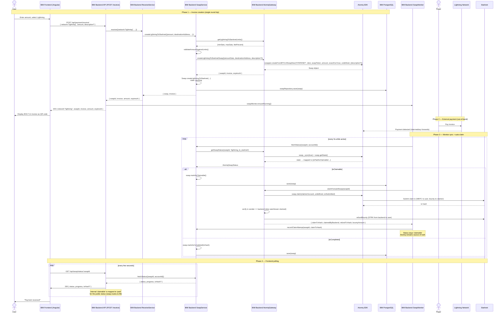

# Receive Lightning — Lightning → Starknet Flow

> **Scope.** This doc describes what happens when a user wants to **receive
> Bitcoin via the Lightning Network** into their BIM wallet. The funds land
> on Starknet as WBTC.
>
> Related docs: [swap-commit.md](./receive-bitcoin-swap-commit.md) (Bitcoin two-phase flow),
> [receive-bitcoin.md](./receive-bitcoin.md), [swap-monitor.md](./swap-monitor.md).

## Overview

A Lightning receive is a **Lightning → Starknet cross-chain swap**
orchestrated by the [Atomiq SDK](https://atomiq.fi/). The backend:

1. Asks Atomiq for a quote and a BOLT-11 invoice.
2. Persists the swap in PostgreSQL (`committed` or `pending` depending on
   the direction — see below).
3. Starts the `SwapMonitor` if it's not already running.
4. Returns the invoice to the frontend, which displays it as a QR code.

When a payer scans and pays the invoice on the Lightning Network, Atomiq
reports the swap as `claimable`. The `SwapMonitor` then submits an
on-chain **claim** transaction on Starknet (signed by the backend's
claimer account), which releases WBTC to the user's Starknet address.
The SDK is the source of truth; BIM only mirrors its state.

Unlike Bitcoin receives (see [swap-commit.md](./receive-bitcoin-swap-commit.md)), Lightning
receives **do not require a security deposit** from the user — the entire
flow is a single HTTP round trip until the invoice is created.

### Components

| Component | Where | Responsibility |
|-----------|-------|----------------|
| Frontend (Angular) | `apps/front` | Collects the amount, shows the QR code, polls status. The Receive page exposes Lightning via a segmented network tab; once the invoice is returned, the UI shows a live BOLT-11 expiry countdown (seconds remaining, red below 2 minutes) and auto-resets to the `Create invoice` state when it hits zero |
| `POST /api/payment/receive/` | `apps/api/src/routes/payment/receive/receive.routes.ts:43` | HTTP route — auth + Zod validation + orchestration |
| `ReceiveService` | `packages/domain/src/payment/receive.service.ts` | Thin dispatcher: routes lightning → `SwapService.createLightningToStarknet()` |
| `SwapService` | `packages/domain/src/swap/swap.service.ts` | Domain use case: validates limits, calls gateway, creates the `Swap` entity, saves it |
| `Swap` entity | `packages/domain/src/swap/swap.ts` | State machine (`pending` → `paid` → `claimable` → `completed`) |
| `AtomiqGateway` port | `packages/domain/src/ports/gateways.ts:176` | Interface |
| `AtomiqSdkGateway` adapter | `packages/atomiq/src/atomiq.gateway.ts` | Wraps the Atomiq SDK |
| `SwapMonitor` | `apps/api/src/monitoring/swap.monitor.ts` | Background poller + auto-claimer. See [swap-monitor.md](./swap-monitor.md) |
| `GET /api/swap/status/:swapId` | `apps/api/src/routes/swap/swap.routes.ts:50` | Status polling endpoint |

---

## Sequence Diagram



---

## Detailed trace — Invoice creation

```
Frontend:
│
├── User enters amount (sats) + optional description
└── POST /api/payment/receive/
      { network: "lightning", amount: "100000", description?: "Coffee" }

POST /api/payment/receive/  (receive.routes.ts:43)
│
├── Auth middleware → sets honoCtx.get('account')
├── ReceiveSchema.parse(body)
│     amount: string /^\d+$/ (optional)
│     description: string max 100 (optional)
│     useUriPrefix: boolean (default true)
│
├── account.getStarknetAddress()
│     → 400 ACCOUNT_NOT_DEPLOYED if missing
│
├── amount = Amount.ofSatoshi(BigInt(input.amount))
│
├── receiveService.receive({
│     network: "lightning",
│     destinationAddress,
│     amount,
│     description,
│     accountId,
│     useUriPrefix
│   })
│
│   ReceiveService.receive()  (receive.service.ts:43)
│   │
│   ├── Guard: amount > 0 (else InvalidPaymentAmountError)
│   └── switch(network) case 'lightning':
│         └── receiveLightning() → swapService.createLightningToStarknet({...})
│
│       SwapService.createLightningToStarknet()  (swap.service.ts:163)
│       │
│       ├── StarknetAddress.of(destinationAddress)
│       │
│       ├── getLightningToStarknetLimits()
│       │     → delegates to swapper.getSwapLimits(BTCLN, swapToken)
│       │     → returns { minSats, maxSats, feePercent }
│       │
│       ├── validateAmountAgainstLimits(amount, limits)
│       │     → throws SwapAmountError if out of range
│       │
│       ├── atomiqGateway.createLightningToStarknetSwap({
│       │       amountSats: amount.getSat(),
│       │       destinationAddress,
│       │       description?
│       │   })
│       │
│       │   AtomiqSdkGateway.createLightningToStarknetSwap()  (atomiq.gateway.ts:235)
│       │   │
│       │   ├── ensureInitialized()
│       │   ├── swapper.createFromBTCLNSwapNew(
│       │   │     'STARKNET',
│       │   │     destinationAddress.toString(),
│       │   │     swapToken.address,       // WBTC by default
│       │   │     amountSats,
│       │   │     true,                    // exactOut — user receives exactly the requested amount
│       │   │     undefined,
│       │   │     description ? {description} : undefined
│       │   │   )
│       │   ├── swapId = swap.getId()
│       │   ├── invoice = swap.getAddress()     // BOLT-11 string
│       │   ├── expiresAt = new Date(swap.getQuoteExpiry())
│       │   └── return { swapId, invoice, expiresAt }
│       │
│       ├── Swap.createLightningToStarknet({
│       │     id: SwapId.of(atomiqSwap.swapId),
│       │     amount, destinationAddress, invoice, expiresAt,
│       │     description, accountId
│       │   })
│       │     → new Swap entity in state { status: 'pending' }
│       │
│       ├── swapRepository.save(swap)        // PostgreSQL via Drizzle
│       │
│       └── return { swap, invoice }
│
├── swapMonitor.ensureRunning()
│     → no-op if already running; otherwise starts the 5s polling loop
│
└── 200 OK {
      network: "lightning",
      swapId,
      invoice,
      amount: { value: sats, currency: "SAT" },
      expiresAt: ISO8601
    }
```

---

## State machine (Lightning direction)

```
                    ┌─────────────────────────────────────────┐
                    │              PENDING  (0%)              │
                    │   Invoice created, waiting for payment  │
                    └───────────────┬─────────────────────────┘
                                    │
                ┌───────────────────┼────────────────────┐
                │                   │                    │
                ▼                   ▼                    ▼
        ┌──────────────┐   ┌──────────────┐    ┌──────────────┐
        │   EXPIRED    │   │    PAID      │    │    FAILED    │
        │  Atomiq LP   │   │  LN payment  │    │  SDK error   │
        │ quote timeout│   │  received at │    └──────────────┘
        └──────────────┘   │  intermediary│
                           │     (33%)    │
                           └──────┬───────┘
                                  │
                                  ▼
                    ┌─────────────────────────────────────────┐
                    │            CLAIMABLE  (50%)             │
                    │  Ready for backend to submit claim tx   │
                    │  Public API reports this as "paid".     │
                    │  Monitor auto-submits the claim tx,     │
                    │  with cooldown = 2 min between attempts.│
                    └───────────────┬─────────────────────────┘
                                    │
                    ┌───────────────┼─────────┐
                    │               │         │
                    ▼               ▼         ▼
             ┌──────────────┐  (stays    ┌────────────┐
             │ REFUNDABLE   │  claimable │  FAILED    │
             │ LP / protocol│  until     │  Claim tx  │
             │  fallback    │  Atomiq    │  reverted  │
             └──────────────┘  confirms  └────────────┘
                               │
                               ▼
                    ┌─────────────────────────────────────────┐
                    │            COMPLETED (100%)             │
                    │   WBTC delivered to user's Starknet     │
                    │   address. Transaction hash persisted.  │
                    └─────────────────────────────────────────┘
```

**States mirror Atomiq.** BIM never invents a status — the `SwapService`
transcribes what the SDK reports. The `SwapMonitor` uses orthogonal
metadata (`lastClaimAttemptAt`, `lastClaimTxHash`) to avoid
double-submitting claim txs while Atomiq has not yet reflected the
on-chain result.

> **Public vs internal status.** The HTTP endpoint
> `GET /api/swap/status/:swapId` maps the internal `claimable` state to
> `paid` for the frontend (see `swap.routes.ts:58-59`). The distinction
> between `claimable` and `paid` is only relevant for backend orchestration
> (claim timing), not for the user.

Progress values (see `swap.ts:279-298`):

| Status | Progress |
|--------|----------|
| `pending` | 0% |
| `committed` | 10% (Bitcoin flow only — not applicable here) |
| `paid` | 33% |
| `claimable` | 50% |
| `completed` | 100% |
| `expired`, `refundable`, `refunded`, `failed`, `lost` | 0% |

---

## Status endpoint (frontend polling)

The frontend polls `GET /api/swap/status/:swapId` every few seconds (no
SSE endpoint is implemented today — see
[swap-monitor.md](./swap-monitor.md#future-work)).

Request: `GET /api/swap/status/{swapId}` (authenticated)

Response (`SwapStatusResponse`, `swap.routes.ts:61`):

```json
{
  "swapId": "abc-123",
  "direction": "lightning_to_starknet",
  "status": "pending" | "paid" | "completed" | "expired" | "refundable" | "refunded" | "failed" | "lost",
  "progress": 0,
  "txHash": "0x...",
  "amountSats": "100000",
  "destinationAddress": "0x...",
  "expiresAt": "2026-01-15T12:30:00.000Z"
}
```

The backend calls `SwapService.fetchStatus({swapId, accountId})` which
re-syncs with Atomiq if the swap is not terminal. An account can only
read **its own** swaps — `fetchStatus` throws `SwapOwnershipError` if the
swap belongs to another account.

---

## Error scenarios

### Atomiq LP quote expires before payment

The LP-provided quote has a short TTL (seconds to a few minutes). If no
one pays the invoice in time, Atomiq reports the swap as `expired` at
the next sync tick. `syncWithAtomiq()` calls `swap.markAsExpired()` and
the monitor stops polling it (terminal state for Lightning).

### Amount out of limits

`SwapAmountError` is thrown by `validateAmountAgainstLimits` in
`SwapService.createLightningToStarknet`. The error message includes the
requested amount and the gateway-reported min/max. The frontend should
surface the limits via `GET /api/swap/limits/lightning_to_starknet`.

### Claim tx reverts

If the backend claim tx reverts (e.g., gas shortage, nonce race), the
adapter logs the reverted tx hash and propagates the error. The monitor
logs the failure but does **not** retry immediately — the claim cooldown
(2 min) prevents re-submission until either Atomiq transitions the swap
or the cooldown expires. After cooldown, the monitor tries again on the
next iteration.

### Watchtower wins the claim race

Atomiq LPs run watchtower processes that also claim forward swaps if no
one else does. The BIM backend tries to claim first (to collect the
claimer bounty), but if the watchtower wins, the SDK silently returns
the watchtower's tx hash. The adapter (`atomiq.gateway.ts:816`) verifies
the on-chain sender and sets `claimedByBackend: false`, in which case
**no bounty refund is executed** (there's nothing to refund). The swap
still completes normally for the user.

### Container restarts mid-swap

On restart, the Atomiq SDK loads all persisted swaps from
`PgUnifiedStorage` (shared PostgreSQL pool) — no state is lost.
However, if a swap ID is ever queried that the SDK cannot find in its
storage (rare, e.g., partial migration), `getSwapStatus()` returns
`state: -2` with an error string and `syncWithAtomiq()` marks it as
**`lost`** (see `swap.service.ts:597-601`). The monitor then stops
polling it to avoid an infinite loop.

---

## Key file references

- Route: `apps/api/src/routes/payment/receive/receive.routes.ts:43-178`
- Zod schema: `apps/api/src/routes/payment/receive/receive.types.ts:3-8`
- Response types: `apps/api/src/routes/payment/receive/receive.types.ts:33-41`
- Status route: `apps/api/src/routes/swap/swap.routes.ts:50-74`
- `ReceiveService.receiveLightning()`: `packages/domain/src/payment/receive.service.ts:102-116`
- `SwapService.createLightningToStarknet()`: `packages/domain/src/swap/swap.service.ts:163-202`
- `SwapService.fetchStatus()`: `packages/domain/src/swap/swap.service.ts:440-467`
- `Swap.createLightningToStarknet()`: `packages/domain/src/swap/swap.ts:37-51`
- `AtomiqGateway` port: `packages/domain/src/ports/gateways.ts:176-250`
- SDK adapter: `packages/atomiq/src/atomiq.gateway.ts:235-290` (create), `679-738` (status), `749-808` (claim)
- `SwapMonitor`: `apps/api/src/monitoring/swap.monitor.ts`
