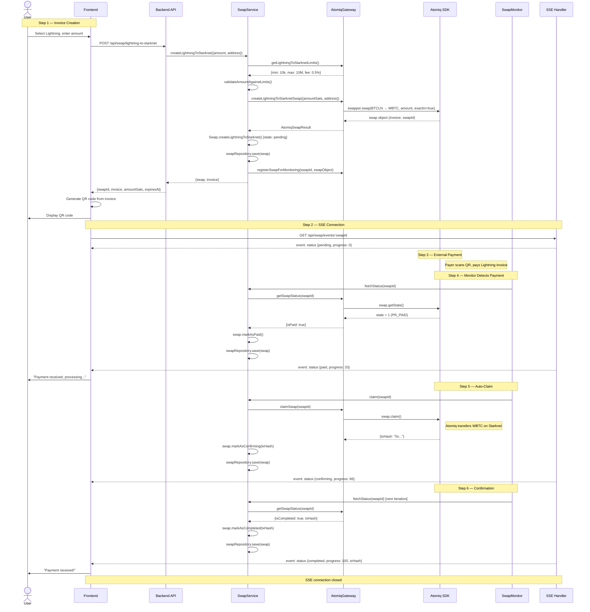

# Receive Lightning — Lightning to Starknet Flow

## Overview

The user wants to **receive Bitcoin via Lightning Network**. The backend creates a cross-chain swap (Lightning → Starknet) via the Atomiq SDK. The user receives a Lightning invoice (BOLT-11), which they share or display as a QR code. When someone pays the invoice, the swap is auto-claimed and WBTC is transferred to the user's Starknet address.

### Actors

| Actor | Role |
|-------|------|
| **User** | BIM app user who wants to receive funds |
| **Frontend** | Angular app displaying QR code and status |
| **Backend API** | Hono server exposing HTTP routes |
| **SwapService** | Domain service orchestrating swap logic |
| **AtomiqGateway** | Adapter communicating with Atomiq SDK |
| **Atomiq SDK** | Cross-chain swap protocol (Lightning ↔ Starknet) |
| **SwapMonitor** | Background process syncing status and auto-claiming |
| **SSE Handler** | Route streaming status updates to frontend |
| **Payer** | External person/wallet paying the Lightning invoice |

---

## Sequence Diagram



---

## Detailed Tree: Invoice Creation

```
User clicks "Create Invoice" on Lightning receive page
│
├── Frontend
│   ├── Read amount from input (in user's display currency)
│   ├── Convert to satoshis via CurrencyService
│   ├── Read starknetAddress from AuthService (current user)
│   └── POST /api/swap/lightning-to-starknet
│       Body: { amountSats: "100000", destinationAddress: "0x..." }
│
├── Backend Route (swap.routes.ts)
│   ├── Validate body with Zod (CreateLightningSwapSchema)
│   │   ├── amountSats: string → BigInt
│   │   └── destinationAddress: string
│   ├── Convert to Amount: Amount.ofSatoshi(amountSats)
│   └── Call swapService.createLightningToStarknet({amount, destinationAddress})
│
├── SwapService.createLightningToStarknet()
│   ├── Validate destination: StarknetAddress.of(input.destinationAddress)
│   │   └── Throws if invalid Starknet address format
│   │
│   ├── Fetch limits: atomiqGateway.getLightningToStarknetLimits()
│   │   └── Returns { minSats: 10000n, maxSats: 10000000n, feePercent: 0.5 }
│   │
│   ├── Validate amount against limits
│   │   └── Throws SwapAmountError if amount < min or amount > max
│   │
│   ├── Create swap via Atomiq
│   │   atomiqGateway.createLightningToStarknetSwap({amountSats, destinationAddress})
│   │   │
│   │   └── AtomiqSdkGateway
│   │       ├── Ensure SDK initialized (lazy init)
│   │       ├── swapper.swap(Tokens.BITCOIN.BTCLN, Tokens.STARKNET.WBTC,
│   │       │               amountSats, exactIn=true, undefined, destinationAddress)
│   │       ├── Extract invoice: swap.getAddress() → "lnbc100000n1p..."
│   │       ├── Register in internal swapRegistry (Map<string, SwapInfo>)
│   │       └── Return { swapId, invoice, expiresAt: now+30min, swapObject }
│   │
│   ├── Validate invoice exists
│   │   └── Throws SwapCreationError if no invoice returned
│   │
│   ├── Create domain entity: Swap.createLightningToStarknet({...})
│   │   └── State: pending, direction: lightning_to_starknet
│   │
│   ├── Save to repository: swapRepository.save(swap)
│   │
│   ├── Register for monitoring: atomiqGateway.registerSwapForMonitoring(swapId, swapObject)
│   │
│   └── Return { swap, invoice }
│
└── Backend Route
    └── Return HTTP 200:
        {
          swapId: "abc123",
          invoice: "lnbc100000n1p...",
          amountSats: "100000",
          expiresAt: "2025-01-15T12:30:00Z"
        }
```

---

## Detailed Tree: Status Monitoring (SwapMonitor iteration)

```
SwapMonitor tick (every 5 seconds)
│
├── Fetch active swaps: swapService.getActiveSwaps()
│   └── Returns all swaps with status NOT IN (completed, expired, failed)
│
└── For each active swap:
    │
    ├── Sync with Atomiq: swapService.fetchStatus(swapId)
    │   │
    │   ├── Read from repository: swapRepository.findById(swapId)
    │   │   └── Throws SwapNotFoundError if missing
    │   │
    │   ├── If swap is already terminal → skip sync, return current state
    │   │
    │   └── syncWithAtomiq(swap):
    │       ├── atomiqGateway.getSwapStatus(swapId)
    │       │   ├── Read swap from internal swapRegistry
    │       │   ├── Call swap.getState()
    │       │   └── Map state to flags: { isPaid, isCompleted, isFailed, isExpired }
    │       │
    │       ├── If isPaid AND local status is 'pending':
    │       │   ├── swap.markAsPaid()
    │       │   └── swapRepository.save(swap)
    │       │
    │       ├── If isCompleted AND local status is not 'completed':
    │       │   ├── Transition through intermediate states if needed
    │       │   ├── swap.markAsCompleted(txHash)
    │       │   └── swapRepository.save(swap)
    │       │
    │       ├── If isFailed:
    │       │   ├── swap.markAsFailed(error)
    │       │   └── swapRepository.save(swap)
    │       │
    │       └── If isExpired:
    │           ├── swap.markAsExpired()
    │           └── swapRepository.save(swap)
    │
    └── If swap status is now 'paid' AND direction is forward:
        │
        └── Auto-claim: swapService.claim(swapId)
            │
            ├── Check expiration: swap.isExpired()
            │   └── If expired: markAsExpired(), throw InvalidSwapStateError
            │
            ├── Check claimable: swap.canClaim()
            │   └── Only 'paid' status can be claimed
            │
            ├── Claim via Atomiq: atomiqGateway.claimSwap(swapId)
            │   ├── Get swap from swapRegistry
            │   ├── Call swap.claim() (SDK auto-executes Starknet transaction)
            │   ├── Call swap.waitTillClaimed() (blocks until confirmed)
            │   └── Return { txHash, success: true }
            │
            ├── Transition: swap.markAsConfirming(txHash)
            ├── Save: swapRepository.save(swap)
            │
            ├── Async: waitForClaimConfirmation(swap, txHash)
            │   ├── atomiqGateway.waitForClaimConfirmation(swapId)
            │   ├── swap.markAsCompleted(txHash)
            │   └── swapRepository.save(swap)
            │
            └── On error:
                ├── swap.markAsFailed(error.message)
                ├── swapRepository.save(swap)
                └── Throw SwapClaimError
```

---

## State Machine

```
                    ┌──────────────────────────────────────┐
                    │            PENDING (0%)               │
                    │  Invoice created, waiting for payment │
                    └─────────────┬────────────────────────┘
                                  │
                    ┌─────────────┼──────────────┐
                    │             │              │
                    ▼             │              ▼
            ┌──────────┐         │      ┌──────────────┐
            │ EXPIRED  │         │      │   FAILED     │
            │ Invoice  │         │      │ SDK error    │
            │ timed out│         │      └──────────────┘
            └──────────┘         │
                                 ▼
                    ┌──────────────────────────────────────┐
                    │              PAID (33%)               │
                    │  Lightning payment received by Atomiq │
                    │  → SwapMonitor auto-triggers claim    │
                    └─────────────┬────────────────────────┘
                                  │
                    ┌─────────────┼──────────────┐
                    │             │              │
                    ▼             │              ▼
            ┌──────────┐         │      ┌──────────────┐
            │ EXPIRED  │         │      │   FAILED     │
            │ (rare)   │         │      │ Claim error  │
            └──────────┘         │      └──────────────┘
                                 ▼
                    ┌──────────────────────────────────────┐
                    │          CONFIRMING (66%)             │
                    │  Claim TX submitted on Starknet       │
                    │  Waiting for on-chain confirmation    │
                    └─────────────┬────────────────────────┘
                                  │
                                  ▼
                    ┌──────────────────────────────────────┐
                    │          COMPLETED (100%)             │
                    │  WBTC transferred to user's address   │
                    └──────────────────────────────────────┘
```

---

## Timing

| Phase | Expected Duration | Timeout |
|-------|-------------------|---------|
| Invoice creation | < 2s | — |
| Waiting for Lightning payment | Instant to minutes | 30 min (invoice expiry) |
| Payment detection (monitor poll) | 0-5s after payment | — |
| Claim execution | 2-10s | 60s |
| Starknet confirmation | 5-30s | 5 min |
| **Total (optimistic)** | **~15s after payment** | — |

---

## Error Scenarios

### Invoice expires before payment

```
Monitor detects: Atomiq state < 0 (expired)
├── syncWithAtomiq() calls swap.markAsExpired()
├── SSE pushes: { status: "expired" }
└── Frontend shows: "Invoice expired, please create a new one"
```

### Claim fails (network error, gas issue)

```
Monitor calls claim() → SwapClaimError
├── swap.markAsFailed(error)
├── SSE pushes: { status: "failed", error: "..." }
├── Monitor tracks retry count
└── If retries < MAX_CLAIM_RETRIES → retry next iteration
```

### User closes browser during swap

```
SSE connection drops (normal)
SwapMonitor continues running independently
├── Detects payment → auto-claims → completes
└── When user reopens:
    ├── Frontend fetches current status
    └── Swap is already completed
```

---

## Implementation TODO

### Backend — Already Exists

- [x] `SwapService.createLightningToStarknet()` — creates swap, returns invoice
- [x] `SwapService.fetchStatus()` — syncs with Atomiq, returns current state
- [x] `SwapService.claim()` — claims a paid swap
- [x] `AtomiqSdkGateway.createLightningToStarknetSwap()` — Atomiq SDK integration
- [x] `AtomiqSdkGateway.claimSwap()` — claim via SDK
- [x] `POST /api/swap/lightning-to-starknet` route
- [x] `GET /api/swap/status/:swapId` route
- [x] `POST /api/swap/claim/:swapId` route

### Backend — To Implement

- [ ] `SwapService.getActiveSwaps()` — return non-terminal swaps
- [ ] `SwapMonitor` class — background polling loop + auto-claim (see [swap-monitor.md](./swap-monitor.md))
- [ ] `GET /api/swap/events/:swapId` — SSE endpoint (see [swap-monitor.md](./swap-monitor.md))
- [ ] Register SwapMonitor in AppContext, start/stop with application lifecycle
- [ ] Add fee information to swap creation response (feePercent, estimatedFee)

### Frontend — To Implement

- [ ] "Create Invoice" button handler: call `POST /api/swap/lightning-to-starknet`
- [ ] Connect to SSE `GET /api/swap/events/:swapId` after invoice creation
- [ ] Display status transitions: pending → paid → confirming → completed
- [ ] Handle invoice expiration (show retry option)
- [ ] Handle errors (show error message + retry)
