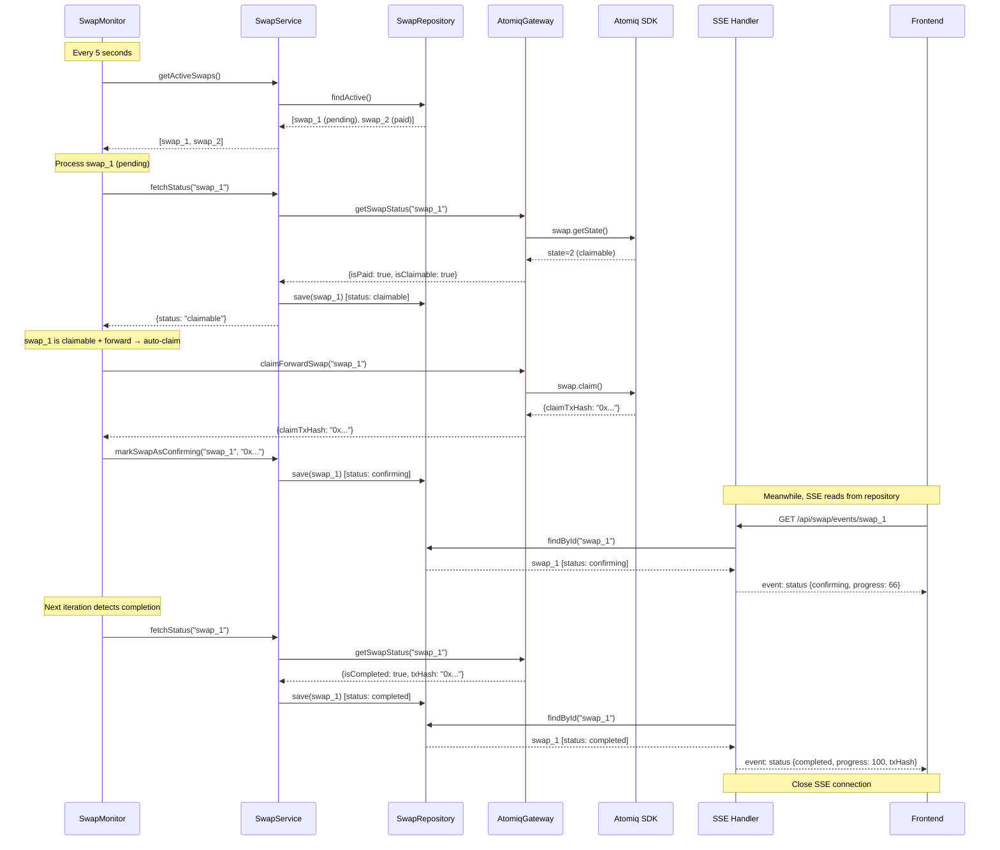

# Swap Monitor — Background Monitoring, Auto-Claim & SSE

## Overview

The swap monitor is the backend component responsible for:

1. **Detecting payment arrival** on active swaps (polling Atomiq SDK)
2. **Auto-claiming** forward swaps (Lightning/Bitcoin receive) when paid
3. **Streaming status updates** to the frontend via SSE

It is a **pure orchestrator** — it calls existing service methods and contains **zero business logic**.

---

## Architecture

```
┌─────────────────────────────────────────────────────────────┐
│                        Backend Process                       │
│                                                              │
│  ┌──────────────┐     ┌──────────────┐    ┌──────────────┐  │
│  │  SwapMonitor  │────>│  SwapService  │───>│ AtomiqGateway│  │
│  │  (scheduler)  │     │  (domain)     │    │ (adapter)    │  │
│  └──────┬───────┘     └──────────────┘    └──────────────┘  │
│         │                     │                              │
│         │              ┌──────┴───────┐                      │
│         │              │SwapRepository │                      │
│         │              └──────────────┘                      │
│         │                     ▲                              │
│  ┌──────┴───────┐             │                              │
│  │  SSE Handler  │────────────┘                              │
│  │  (route)      │                                           │
│  └──────┬───────┘                                           │
│         │                                                    │
└─────────┼────────────────────────────────────────────────────┘
          │ SSE stream
          ▼
     ┌──────────┐
     │ Frontend  │
     └──────────┘
```

### Separation of Concerns

| Component | Layer | Responsibility |
|-----------|-------|----------------|
| `SwapMonitor` | Infrastructure | Timer scheduling. Calls service methods at regular intervals. **No business logic.** |
| `SwapService` | Domain | All swap logic: status sync, state transitions, claim orchestration |
| `SSE Handler` | Infrastructure (route) | Reads swap state from repository, streams to connected clients |
| `SwapRepository` | Port | Persistence of swap state |
| `AtomiqGateway` | Port | Communication with Atomiq SDK |

---

## Scalability: Future Extraction

Currently, the `SwapMonitor` runs **in-process** alongside the API server. This is sufficient for the current load.

When scaling to multiple backend instances:

1. **Extract the monitor** to a dedicated process (separate deployment)
2. The monitor calls the **same service methods** via internal HTTP endpoints
3. The API exposes internal routes (e.g., `/internal/swaps/active`, `/internal/swaps/:id/claim`) that mirror the service API
4. These internal routes are **not exposed to the frontend** (network-level isolation or auth)
5. The service layer remains unchanged — only the transport layer changes

```
Current (single process):
  SwapMonitor ──> SwapService (in-process call)

Future (multi-process):
  SwapMonitor ──> HTTP /internal/swaps/... ──> SwapService
```

This means:
- **Service methods are the internal API** — they must remain clean and stateless
- **The monitor has no business logic** — it can be replaced by a cron job, a message consumer, etc.
- **Testing without the monitor** is trivial: call service methods directly

---

## SwapMonitor: Background Loop

### Behavior

```
Every POLL_INTERVAL (5 seconds):
│
├── 1. Fetch all active (non-terminal) swaps
│      SwapService.getActiveSwaps()
│      → returns swaps where status NOT IN (completed, expired, failed)
│
├── 2. For each active swap:
│   │
│   ├── 2a. Sync status with Atomiq
│   │       SwapService.fetchStatus(swapId)
│   │       → internally calls AtomiqGateway.getSwapStatus()
│   │       → updates local Swap entity state
│   │       → saves to SwapRepository
│   │
│   └── 2b. If swap is now 'claimable' AND direction is forward (receive):
│           AtomiqGateway.claimForwardSwap(swapId)
│           SwapService.markSwapAsConfirming(swapId, txHash)
│           → transitions: claimable → confirming → completed
│           → saves to SwapRepository
│
└── 3. Log iteration summary (active count, claimed count, errors)
```

### What "forward swap" means

Forward swaps are **receive** operations where funds flow **into Starknet**:
- `lightning_to_starknet` — user receives Lightning payment, gets WBTC
- `bitcoin_to_starknet` — user receives Bitcoin, gets WBTC

These require **manual claim** via the Atomiq SDK. The monitor handles this automatically.

Reverse swaps (`starknet_to_lightning`, `starknet_to_bitcoin`) are **send** operations where the Atomiq SDK handles claiming automatically. The monitor only tracks their status, it does not claim them.

### Configuration

| Parameter | Default | Description |
|-----------|---------|-------------|
| `POLL_INTERVAL` | 5000ms | Time between monitoring iterations |
| `CLAIM_RETRY_DELAY` | 10000ms | Delay before retrying a failed claim |
| `MAX_CLAIM_RETRIES` | 3 | Maximum claim attempts per swap |

### Lifecycle

```
Application startup:
  1. Create SwapMonitor(swapService, swapRepository)
  2. Call monitor.start()
  3. Monitor begins polling loop

Application shutdown:
  1. Call monitor.stop()
  2. Wait for current iteration to complete
  3. Cleanup
```

### Error Handling

```
Monitoring iteration:
├── Single swap sync fails
│   └── Log error, continue to next swap (don't abort the iteration)
│
├── Single swap claim fails
│   ├── Increment retry counter for that swap
│   ├── If retries < MAX_CLAIM_RETRIES → retry next iteration
│   └── If retries >= MAX_CLAIM_RETRIES → log critical error, skip swap
│
└── Entire iteration fails (e.g., repository unavailable)
    └── Log error, wait for next interval, retry
```

---

## SSE: Status Streaming

### Endpoint

```
GET /api/swap/events/:swapId
```

Opens a Server-Sent Events stream for a specific swap. The connection stays open until the swap reaches a terminal state or the client disconnects.

### Behavior

```
Client connects to SSE for swapId:
│
├── 1. Validate swapId exists in repository
│      → If not found: send error event, close
│
├── 2. Send initial status event immediately
│      { status, progress, txHash, direction, ... }
│
├── 3. Enter read loop (every SSE_POLL_INTERVAL):
│   │
│   ├── Read swap from repository (NOT from Atomiq — the monitor already syncs)
│   │
│   ├── If status changed since last push:
│   │   └── Send status event to client
│   │
│   └── If swap is in terminal state (completed, expired, failed):
│       └── Send final event, close connection
│
└── 4. On client disconnect: clean up
```

### Event Format

```
event: status
data: {"swapId":"abc","status":"pending","progress":0,"direction":"lightning_to_starknet"}

event: status
data: {"swapId":"abc","status":"paid","progress":33}

event: status
data: {"swapId":"abc","status":"confirming","progress":66,"txHash":"0x..."}

event: status
data: {"swapId":"abc","status":"completed","progress":100,"txHash":"0x..."}
```

### Why SSE reads from repository, not Atomiq

The SSE handler does **not** call `AtomiqGateway.getSwapStatus()`. It reads the latest state from `SwapRepository`, which the `SwapMonitor` keeps up-to-date.

Reasons:
- **No duplicate Atomiq calls**: Monitor already syncs every 5s
- **Consistent state**: All clients see the same state from the same source
- **Decoupled**: SSE handler doesn't depend on Atomiq availability
- **Scalable**: Repository reads are cheap (in-memory Map lookup)

### SSE vs Polling Trade-offs

| Aspect | SSE | Frontend Polling |
|--------|-----|-----------------|
| Latency | ~0s (push on change) | Poll interval (3-5s) |
| Network overhead | 1 persistent connection | 1 HTTP request per interval |
| Server complexity | Connection management | Stateless |
| Reconnection | Built-in (`EventSource` auto-reconnects) | Built-in (just keeps calling) |
| Compatibility | All modern browsers | Universal |

SSE was chosen for lower latency during the payment confirmation UX, where the user is actively watching the screen.

---

## Implementation TODO

### Domain Layer

- [ ] Add `SwapService.getActiveSwaps(): Promise<Swap[]>` — returns all non-terminal swaps (calls `swapRepository.findActive()`)
- [ ] In `SwapService.claim()`, add retry tracking (claim attempt count in Swap entity or separate tracking)

### Infrastructure Layer

- [ ] Create `SwapMonitor` class (in `apps/api/src/services/` or `apps/api/src/monitoring/`)
  - Constructor: `SwapMonitor(swapService, swapRepository, config)`
  - Methods: `start()`, `stop()`
  - Internal: `private async runIteration()`
- [ ] Register `SwapMonitor` in `AppContext`, start in `main.ts`
- [ ] Handle graceful shutdown (stop monitor before closing server)

### SSE Route

- [ ] Create `GET /api/swap/events/:swapId` route
- [ ] Use Hono's `streamSSE()` from `hono/streaming`
- [ ] Register route in `app.ts`

### Edge Cases

- [ ] Bitcoin deposit tracking: prevent "expired" status when deposit is already confirmed (see [receive-bitcoin.md](./receive-bitcoin.md))
- [ ] Concurrent claim prevention: if monitor and a manual claim call race, only one should proceed (use swap state as guard — `canClaim()` returns false after first transition)
- [ ] Stale swap cleanup: periodically delete old terminal swaps from in-memory repository to prevent memory leak

---

## Sequence Diagram: Full Monitoring Cycle


